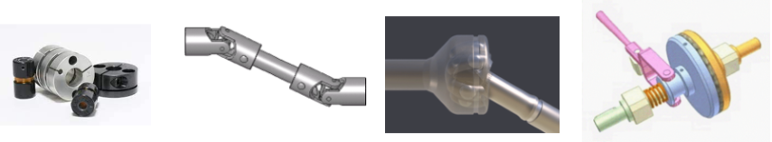
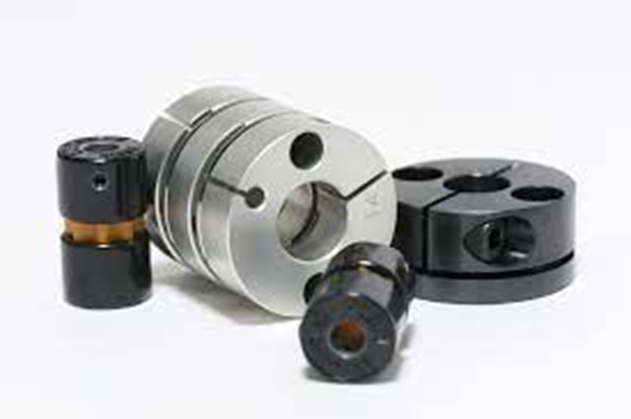

# Mecanismos de acoplamiento

Son dispositivos que se utilizan para conectar dos ejes de manera que puedan transmitir energía mecánica entre ellos.

Los acoplamientos pueden ser rígidos, flexibles, de engranajes, hidráulicos, entre otros

## Acoplamiento por manguito

Tipo de acoplamiento sencillo adecuado para máquinas con velocidades reducidas y de uso ocasional.

La estructura está formada por un manguito de fundición con un canal interior que acoge dos chavetas, las cuales sostienen los extremos de los ejes y se fijan al manguito mediante tornillos de cabeza avellanada.

## Junta cardan

La junta Cardan és un element mecànic que s'utilitza per a transferir el moviment de rotació d'un eix a un altre quan estan desalineats. Està formada per dues forquilles solidàries als arbres d'entrada i de sortida, i una peça central denominada creueta.

Quan l'eix d'entrada gira, arrossega la creueta, i aquesta a la vegada arrossega l'eix de sortida. No obstant, la velocitat de gir de sortida sofreix algunes variacions a causa dels angles que es formen.

Per evitar aquestes variacions, s'instal·len sempre dues juntes Cardan que es compensen entre si. A aquest element se l'anomena doble Cardan.

## Junta homocinètica

La junta homocinètica té com a finalitat connectar dos eixos situats longitudinalment que no són continus, de manera que la velocitat entre ells sigui sempre igual.

Aquesta connexió es fa a través del palier de transmissió de les rodes, que s'uneix per un extrem amb el diferencial i per l'altre amb la caixa de la roda.

Aquesta transmissió està sotmesa a moviments oscil·latoris de la suspensió i moviments giratoris de la direcció, per la qual cosa ha de ser articulada. La junta homocinètica actua com una mena de ròtula complexa que permet aquests moviments sense que les rodes perdin tracció ni les transmissions es vegin afectades.

En la siguiente imagen vemos como los palieres se unen a las ruedas mediante juntas homocinéticas.

## Embrague

El embrague es responsable de conectar y desconectar el motor de la caja de cambios. Cuando se presiona el pedal del embrague, se desconecta el motor de la caja de cambios, permitiendo cambiar de marcha sin interrupciones en la rotación del motor.

### Disco de Embrague

El componente clave del sistema de embrague es el disco de embrague. Este disco, situado entre el volante del motor y el platillo de presión, se conecta al motor y a la caja de cambios.

- Cuando el pedal del embrague se presiona, el disco de embrague se separa del volante del motor, interrumpiendo la transmisión de energía
- Cuando se libera el pedal del embrague, la presión se aplica al disco, conectando así el motor y la caja de cambios. Al presionar el pedal del embrague, se reduce la presión, desconectando el motor de la caja de cambios.

Pedal del Embrague: En un vehículo con transmisión manual, el conductor controla el embrague a través del pedal del embrague. Al presionar este pedal, se desacopla el motor de la caja de cambios, permitiendo cambiar de marcha. Al soltar el pedal, se vuelve a conectar la transmisión.

Su función principal es desacoplar momentáneamente el motor de la transmisión para permitir cambios de marcha suaves y precisos.

https://www.youtube.com/watch?v=WxRq_bNBmjQ

https://www.youtube.com/watch?v=4Syt_01ZRzA