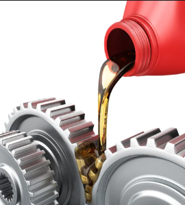
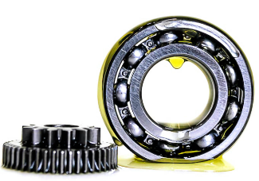
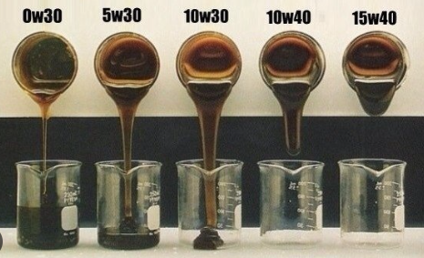
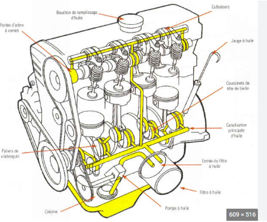
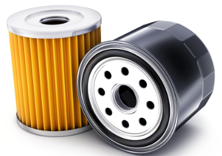

[🔙 Enrere](../) | [🏠 Pàgina principal](http://danimrprofe.github.io/apuntes/)

# Lubrificació

La ``lubricació`` és el procés de posar una substància entre dues peces per disminuir el fregament i prevenir l'oxidació, la brutícia i altres formes de desgast. Això produeix una millor eficiència i vida útil dels mecanismes.

## Manteniment

Un manteniment adequat del sistema de lubricació i la neteja també són essencials per a una lubricació eficaç. Si la lubricació és inadequada o insuficient, es pot provocar un augment del fregament i de la temperatura, cosa que pot accelerar el desgast i afectar negativament la vida útil dels mecanismes.

## Olis

La denominació de l'oli es basa en una ``escala de viscositat`` que es mesura a través d'un procediment estandarditzat i establert per la [Societat d'Enginyers d'Automoció (SAE)](https://www.sae.org/). Aquesta escala classifica els olis segons la seva consistència o viscositat a diferents temperatures.

En la denominació de l'oli es fa referència a la seva viscositat a 100 graus Celsius, la qual es representa amb la lletra "W" (que significa "Winter" o hivern en anglès). Així, per exemple, un oli 10W-40 té una viscositat de 10 a baixes temperatures (en fred) i de 40 a altes temperatures (en calent).

## Circuits

Els sistemes de lubrificació disposen de diferents mecanismes per a la recirculació del lubricant. L'oli ha de ser bombejat a través del circuit i després retornat a un recipient (``càrter``) on es recull.

El ``càrter`` es troba a la part inferior del motor.

## Filtres

A partir d'aquí, el procés comença de nou. La reutilització de l'oli requereix filtració. El filtratge en derivació implica la presa d'una derivació d'oli a pressió abans de que arribi als punts de lubricació per passar-lo per un filtre.

Això té l'avantatge que, si el filtre s'obstrueix, la lubricació no es veu afectada. El filtratge en ple cabal implica que una bomba recull l'oli del càrter i l'envia directament al filtre, i s'utilitza en motors de velocitat baixa.
