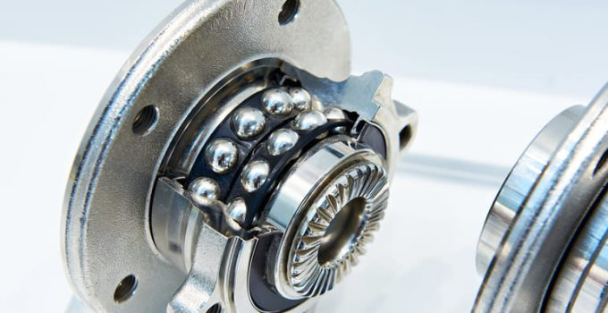
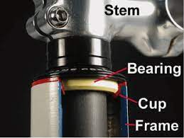
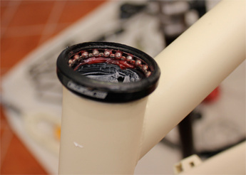

# Soporte de elementos mecánicos

Los cojinetes y rodamientos se utilizan en una gran variedad de máquinas, desde ventiladores y bombas hasta automóviles y aviones.

Los rodamientos son especialmente importantes en las ruedas de los automóviles, ya que soportan el peso del vehículo y permiten que las ruedas se muevan libremente.

## Cojinetes

Els coixinets són elements fonamentals per als mecanismes que necessiten suportar moviments giratoris i realitzar diferents funcions, com sustentar el pes, guiar la rotació i evitar desplaçaments. Aquests coixinets poden ser col·locats en el bastidor de la màquina o suports independents que en facilitin el muntatge.

En funció de la forma en què es produeix el lliscament de l'eix, hi ha dos tipus de coixinets: els de fricció i els de rodaments.

En els coixinets de fricció, els eixos giren lliscant en el coixinet

En els coixinets de rodaments s'interposen una sèrie d'esferes, cilindres i cons, el que fa que el lliscament es produeixi per rodadura i disminueixi el coeficient de fregament.

En resum, els coixinets són elements essencials per als mecanismes que necessiten suportar moviments giratoris i realitzar diferents funcions, i la seva correcta elecció és clau per a l'optimització dels mecanismes.

