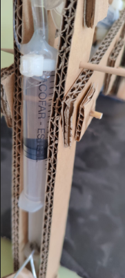
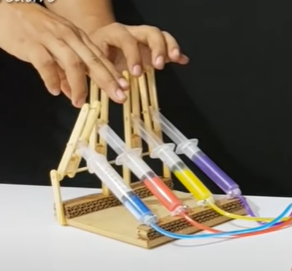

# <!-- fit --> Braç hidràulic

<!-- _class: invert-->

# Objectiu

Volem construir un braç hidràulic accionat per aigua. Per això farem servir 3 circuits amb xeringues, que transmetran la força d'un extrem al punt del braç que volem moure.

# Materials (per grup)

---

- 6 xeringues de 10 ml
- Brides
- Pals de pinxo
- Pals de gelat
- Tub de PVC 4 mm / 6 mm
- Cola termofusible
- Blau de metilé i altres tints

# Eines

- Pistola termofusible
- Cutter o tissores
- Pipeta i tassons per emplenar els circuits

# Procés

1. Mesurar totes les peces a partir del model de referència
2. Tallar la base de cartró
3. Tallar les peces de cartró a mida
4. Pintar les peces
5. Aferrar les peces de catró i fixar-les amb pals
6. Col·locar les xeringues, procurant fer els forats necessaris amb un pern calent

---

7. Fixar les xeringues corresponents amb brides

---

8. Fixar les xeringues a la base amb cola termofusible

9. Emplenar els circuits de les xeringues amb aigua tintada
10. Comprovar el funcionament
11. Muntar la pinsa

# Opcional

Podem crear un sistema de palanques per tal d'accionar les xeringues.

