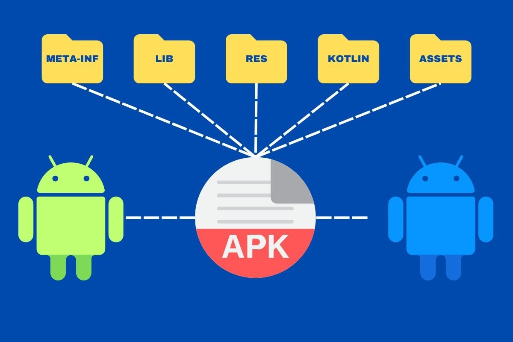

#  Aplicaciones, Tiendas, Archivos APK e Instalación en Dispositivos Móviles

## Aplicaciones Móviles

Las aplicaciones móviles, o simplemente "apps", son programas diseñados para funcionar en dispositivos móviles, como teléfonos inteligentes y tabletas. Pueden servir una amplia variedad de propósitos, desde redes sociales hasta productividad, juegos y herramientas de edición de fotos.

## Tiendas de Aplicaciones (App Stores)

- **Definición:** Plataformas en línea donde los usuarios pueden buscar, descargar e instalar aplicaciones en sus dispositivos móviles.
- **Ejemplos:** App Store de Apple, Google Play Store para dispositivos Android, Microsoft Store para dispositivos Windows.

## Archivos APK

- **Definición:** Formato de archivo utilizado para distribuir e instalar aplicaciones en dispositivos Android.
- **Significado:** APK significa "Android Package" y contiene todos los elementos necesarios para la instalación de una aplicación en un dispositivo Android, incluidos los archivos de código, recursos y metadatos.

## Instalación de Aplicaciones

- **Método Tradicional:** Se realiza a través de la tienda de aplicaciones correspondiente.
  - Buscar una aplicación.
  - Hacer clic en el botón de descarga e instalación.
- **Instalación desde Fuentes Externas (Archivos APK):**
  - Descargar el archivo APK de una fuente externa.
  - Habilitar la opción de instalación de aplicaciones de fuentes desconocidas en la configuración del dispositivo.
  - Instalar manualmente el archivo APK en el dispositivo.

## Precauciones de Seguridad

Es importante tener en cuenta que al instalar aplicaciones desde fuentes externas, los usuarios deben tomar precauciones adicionales para garantizar la seguridad de sus dispositivos:

- Verificar la autenticidad de la fuente de descarga.
- Habilitar la opción de instalación de aplicaciones de fuentes desconocidas en la configuración del dispositivo.

En resumen, las **aplicaciones móviles** son programas diseñados para dispositivos móviles, las **tiendas de aplicaciones** son plataformas para descargar e instalar aplicaciones, los **archivos APK** son el formato de archivo utilizado para distribuir aplicaciones en dispositivos Android, y la **instalación de aplicaciones** puede realizarse tanto desde tiendas de aplicaciones oficiales como desde fuentes externas mediante archivos APK.
