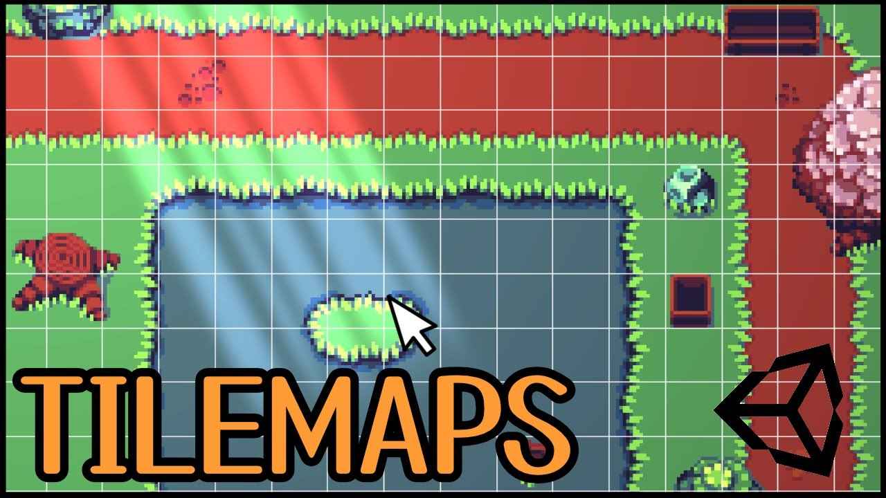
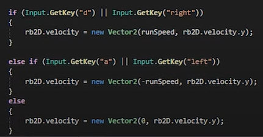
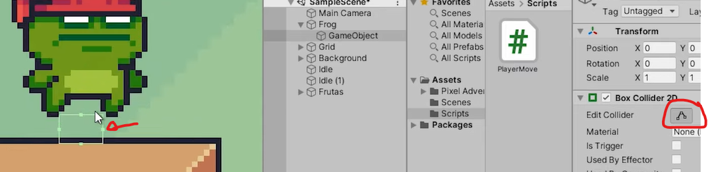
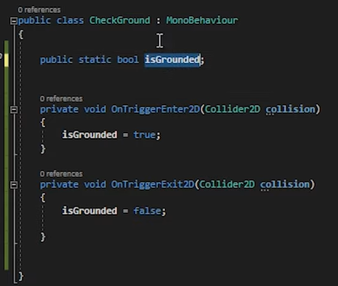
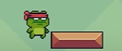
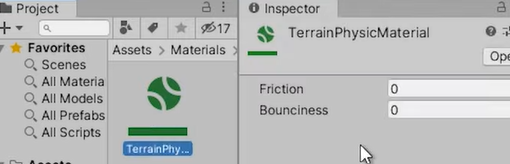

# Plataformas 2D

En este proyecto crearemos un juego de tipo plataformas siguiendo los videotutoriales de **luiscanary**.

La playlist con los vídeos está en el siguiente enlace:

https://www.youtube.com/watch?v=-m7ZaHhkDAc&list=PLNEAWvYbJJ9kZpaIg2RfzAc_KZixBgchT

## 1. Crear proyecto

## 2. Importar assets

En este proyecto utilizaremos **assets**, recursos creados por otros usuarios que ponen a disposición gratuitamente para quien los quiera aprovechar.

Estos assets incluyen, entre otros:

- Imágenes y animaciones
- Fondos
- Sonidos

Importar package de asset store (pixel adventure 1)

## 3. Crear tilemap

Un ``tilemap`` es una herramienta de ``Unity`` que permite crear ambientes de juego mediante el uso de gráficos de losetas. Esta herramienta proporciona una manera fácil y eficiente de organizar, crear y modificar grandes áreas de juego usando una variedad de gráficos tiles.

## 4. Crear paleta y pintar la escena

## 5. Asignar collider al tilemap

## Colisiones

Ahora mismo estos objetos que tenemos aquí simplemente tienen una posición en nuestro mundo y un componente para visualizarlos. Vamos a agregarles ``colliders`` a nuestros objetos.

Los colliders son  componentes que se añaden a estos objetos

Para que tengan colisiones vamos a seleccionarlos todos. Podéis seleccionar el primer elemento y con **shift** pulsado seleccionamos el último y se seleccionarán todos los que tengáis pues desde el primero hasta el último básicamente

Si que no queréis que alguno por ejemplo en mi caso no que recoger la línea del centro porque no quiero que tenga esa colisión porque imagino que tenemos la bola aquí y conexiones con el centro y puesto que no tendría sentido básicamente porque a lo mejor si vengo desde aquí y colisionó colisión colisión y comisionó mi ``Player1`` va a ganar otro rato porque no puede pasar para allá entonces lo que sí vamos a hacer es nombrarlo para que sepamos qué es el centro que en este caso por estirando cuenta que es el ``Goal2`` llamamos centro y a este es al que no tenemos que añadirle colisión.

Seleccionamos todos los demás objetos, añadir componente y añadimos un ``box collider 2D`` que sé que tenemos por aquí así pues ya tendrán colisiones.

Para asignar un collider al tilemap, primero necesitamos habilitar el tilemap colisiones en el editor de ``Unity``. Esto se puede hacer en el inspector del tilemap, seleccionando la carpeta "Tilemap Collider 2D". Luego, seleccione todas las capas de su tilemap y active la casilla "Generar Colliders". Esto generará automáticamente un collider en el tilemap.

## 6. Asignar rigidbody al personaje

## 7. Crear movimiento lateral del personaje

Colocar collider al personaje y modificarlo

## 8. Crear salto del personaje

Necesitaremos un script que compruebe que el personaje está tocando suelo:

En el script de movimiento del personaje, comprobaremos que pulsamos espacio y, además, que estamos tocando suelo:

Cambiar material del tilemap para reducir rozamiento y evitar flotar

Crearemos un material para el mapa, que tendrá 0 fricción, por lo que el personaje se moverá con más suavidad y evitaremos que se enganche a él.

## 9. Mejorar el salto (betterjump)

Nos tocará crear un boolean para activar un salto mejorado, que dependerá del tiempo de pulsación de la tecla, pudiendo saltar más o menos.

## 10. Recolección de fruta con animación

Habrá que crear un script que detecte la colisión de la manzana con el player, se va a llamar ``FruitCollected``, y posteriormente destruir el objeto manzana. Este script se lo asignaremos luego a todas las frutas.

