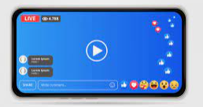

[🔙 Enrere](../) | [🏠 Pàgina principal](http://danimrprofe.github.io/apuntes/)

# 09. Almacenamiento

## Tarjetas de memoria

Con la invención de las **tarjetas de memoria**, los vídeos se pasan a grabar en estas tarjetas. Las tarjetas se pueden intercambiar entre dispositivos, y gracias a ellas tenemos más espacio para guardar fotos o vídeos.

## Memoria interna

Los dispositivos tienen una **memoria interna** dentro, que no se puede extraer. Se utiliza para guardar las apps y el sistema operativo. Con el tiempo estas memorias se han hecho más grandes y, en general, ya no suele ser necesaria una tarjeta de memoria para guardar vídeo, fotos o música, sino que se guardan en la memoria interna del dispositivo.

Les capactitats més habituals són **128 GB, 256 GB, 512 GB, 1 TB**, i depenen del model.

## Discos externs

Per a un creador de vídeo, disposar de discos durs com a mitjà d'emmagatzemament és essencial per guardar els arxius de vídeo de manera segura i accessible. Les dades de vídeo són grans i ocupen una gran quantitat d'espai, de manera que un disc dur ofereix la capacitat necessària per a emmagatzemar una gran quantitat de material de vídeo.

Els discs durs externs també ofereixen una solució portàtil per al transport de dades. Això permet als creadors de vídeos portar el seu treball amb ells, realitzar còpies de seguretat, transferir arxius a altres dispositius i compartir els seus vídeos amb altres professionals o clients.

# Servicios en la nube

Tanto las tarjetas como la memoria interna necesitaban de una conexión a un ordenador o portátil para poder editar el vídeo, así como guardarlo o subirlo a internet y compartirlo, generalmente mediante un cable tipo USB o Firewire.

Hoy en día las **conexiones de datos** han aumentado de velocidad y las tecnologías inalámbricas o Bluetooth han permitido la conexión sin cable. Esto, junto a que las compañías ofrecen servicios de **almacenamiento en la nube** y las redes sociales, han permitido que el vídeo ya no sea necesario  enviarlo a otro dispositivo, sino que lo podemos grabar, editar y subir a Internet directamente.

## Emissió en directe

Existen también plataformas de vídeo online, como **YouTube** o **Twitch** que permiten crear canales, suscribirse a ellos, y comentar, pareciéndose cada vez más a una red social propiamente dicha.

Estas plataformas han ido evolucionando y permiten también editar el contenido desde la propia página web, o por ejemplo la **transmisión en directo**.

