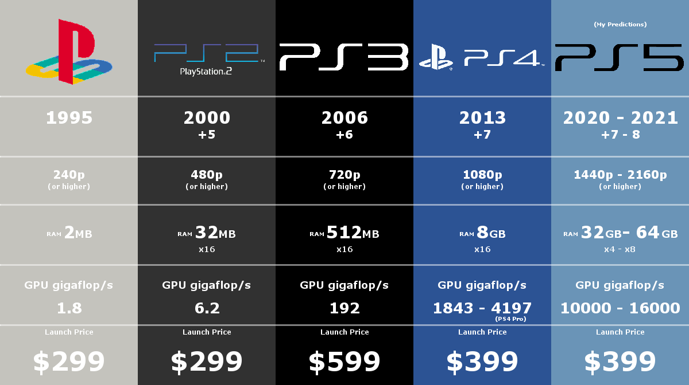

- [Video digital](#video-digital)
  - [Característiques](#característiques)
  - [Streaming](#streaming)
- [02. Resolución](#02-resolución)
- [Resoluciones más importantes](#resoluciones-más-importantes)
  - [Resolución en monitores](#resolución-en-monitores)
- [Relació d'aspecte](#relació-daspecte)
  - [¿Qué es?](#qué-es)
  - [Relacions més habituals](#relacions-més-habituals)
- [FPS](#fps)
  - [Frames o fotogramas](#frames-o-fotogramas)
  - [Frames por segundo](#frames-por-segundo)
  - [¿Cuáles son los valores de FPS más habituales?](#cuáles-son-los-valores-de-fps-más-habituales)
  - [¿Qué inconvenientes tiene grabar a una alta tasa de FPS?](#qué-inconvenientes-tiene-grabar-a-una-alta-tasa-de-fps)
  - [¿Qué valores podemos usar en Internet?](#qué-valores-podemos-usar-en-internet)
- [Bitrate o taxa de bits](#bitrate-o-taxa-de-bits)
  - [¿De qué depèn?](#de-qué-depèn)
- [Frecuencia de refresco](#frecuencia-de-refresco)
- [07. Alta definición](#07-alta-definición)
  - [4K y superiores](#4k-y-superiores)
  - [Equipamiento](#equipamiento)
  - [Blu-ray Ultra HD](#blu-ray-ultra-hd)
- [09. Almacenamiento](#09-almacenamiento)
  - [Tarjetas de memoria](#tarjetas-de-memoria)
  - [Memoria interna](#memoria-interna)
  - [Discos externs](#discos-externs)
- [Servicios en la nube](#servicios-en-la-nube)
  - [Emissió en directe](#emissió-en-directe)
- [11. Evolución hacia el streaming](#11-evolución-hacia-el-streaming)
  - [Televisión en España](#televisión-en-españa)
  - [Canales autonómicos](#canales-autonómicos)
  - [1986. Vídeo VHS](#1986-vídeo-vhs)
  - [Cadenas privadas](#cadenas-privadas)
- [1990. Canales de pago](#1990-canales-de-pago)
- [1997. Televisión por satélite](#1997-televisión-por-satélite)
  - [Emisión de canales a través de la conexión a Internet](#emisión-de-canales-a-través-de-la-conexión-a-internet)
- [12. Videojuegos](#12-videojuegos)
  - [Consolas](#consolas)
  - [Tarjeta gráfica o GPU](#tarjeta-gráfica-o-gpu)
  - [Monitor](#monitor)
  - [Ordenadores](#ordenadores)
- [Tecnología 3D](#tecnología-3d)
  - [Funcionamiento](#funcionamiento)
- [Videoconferencia](#videoconferencia)
- [08. Formatos de vídeo](#08-formatos-de-vídeo)
  - [MP4](#mp4)

# Video digital

## Característiques

Aquestes característiques determinen la qualitat i el rendiment del vídeo digital. Al triar una configuració de vídeo adequada per a una determinada aplicació, és important considerar la relació entre aquestes característiques per aconseguir un equilibri adequat entre la qualitat i l'eficiència d'emmagatzematge i transmissió.

- [Resolució](resolucion.md)
- [Fotogrames per segon](fps.md)
- [Taxa de bits](bitrate.md)
- [Formats](formatos-video.md)

- [Edició de vídeo](edicion/)

## Streaming

Streaming és el procés de transmetre o rebre contingut de vídeo o àudio en temps real a través d'Internet, mentre que YouTube i [Twitch](../twitch/index.md) són plataformes populars per transmetre contingut en viu.

[OBS](../obs/) és un programari que permet capturar i transmetre el contingut a aquestes plataformes de streaming.

# 02. Resolución

Las imágenes digitales se guardan en forma de **píxeles**. Cada píxel tiene un color y una posición en la imagen, que se guarda en forma de 1s y 0s en el ordenador.

La información de todos los píxeles que contiene una imagen se guarda en un archivo.

Define el máximo detalle que se puede obtener de la imagen y determina su calidad. El tamaño de la imagen se calcula como el producto de  píxeles horizontales y  píxeles verticales de la imagen.

Si tuviéramos más píxeles, como en una imagen de 1280 x 720, la calidad sería mucho mejor y tendría más definición. Por contra, ocuparía más espacio. Esta imagen tendría una resolución de 921.600‬ de píxeles. A llegar a 1.000.000, se cuentan por millones de píxeles o **megapíxels**.

Para indicar la resolución de una imagen se utiliza habitualmente solo los **píxeles de la vertical** seguidos de una letra:

- P si el video es progresivo
- I si el video es entrelazado

Por ejemplo, los vídeos en fullHD tienen una resolución de 1080p. Esto significa que la imagen mide 1080 píxeles en vertical y el video es del tipo progresivo.

<https://www.youtube.com/watch?v=5flF7bgWgr4>

La cantidad de píxeles que tiene una imagen determina su resolución.

A mayor resolución, mayor tamaño tiene la imagen y, en general, definición. Es decir, más detalles se aprecian en la imagen, por lo cual suele tener mejor calidad.

# Resoluciones más importantes

Las resoluciones más importantes están estandarizadas. Esto permite que en todo el mundo todos entendamos lo mismo.

- El factor más importante es el tamaño vertical.
- Cuando a lo alto la imagen tiene 1080 píxeles se dice que es de calidad ``FullHD``.
- En el caso de 1440 se trata de calidad ``2K``
- Cuando es de 2160 (el doble), se dice que es UltraHD o ``4K``.

## Resolución en monitores

Los monitores, pantallas o proyectores también tienen una ``resolución máxima``. Es decir, que solo pueden mostrar imágenes de una resolución concreta o inferior (de menor calidad).

Si por ejemplo nuestro monitor es FullHD (1080),no podrá mostrar contenido 4K (2160) porque la pantalla no tiene píxeles suficientes para ello. En ajustes podemos ver las resoluciones que admite nuestro monitor.

En cambio, en este televisor podremos ver contenido hasta 4K de resolución. Pensad que la calidad de lo que veamos en ella dependerá de la fuente.

Es decir, si pongo un canal de TV, pongo un Blu-ray normal o juego en una PS4, no encontraremos contenido de mayor resolución que FULL HD.

En cambio, si tenemos Netflix con capacidad de 4K, películas Ultra HD Blu-ray o una PS5, estos sí nos darán resolución de 4K.

# Relació d'aspecte

## ¿Qué es?

No todas las pantallas tienen la misma forma. Es decir, las proporciones son diferentes en una pantalla de cine, que en una tele o un smartphone. A esto se le llama aspect ratio o relación de aspecto.

La ``relació d'aspecte`` en pantalles es refereix a la proporció entre l'amplada i l'alçada de la pantalla. És una mesura important a considerar quan es selecciona una pantalla per a un propòsit particular, ja que la relació d'aspecte afecta la forma en què es mostren les imatges i els vídeos en la pantalla.

## Relacions més habituals

Algunes de les relacions d'aspecte més comuns són:

- ``4:3``: Aquesta relació d'aspecte és típica de les pantalles més antigues i és amplament utilitzada en la transmissió de televisió estàndard i en presentacions d'oficina.
- ``16:9``: Aquesta relació d'aspecte és la més comuna en les pantalles modernes i és àmpliament utilitzada en televisors, ordinadors portàtils i monitors de PC. És la relació d'aspecte preferida per als continguts de vídeo d'alta definició (HD) i 4K.
- ``21:9``: Aquesta relació d'aspecte s'utilitza principalment en pantalles d'ultra ampla i en monitors per a jocs i entreteniment. Aquesta relació d'aspecte és més ampla que la 16:9 i permet als espectadors veure més contingut horitzontalment.

<https://www.youtube.com/watch?v=z_VtxrKolZU>

# FPS

Los vídeos no son más que secuencias de fotos, una después de la otra, que al reproducirse dan sensación de movimiento. Antiguamente estas fotos (fotogramas) se grababan en rollos de cinta.

## Frames o fotogramas

Cada fotograma (frame) se divide en líneas horizontales y líneas verticales. Cada puntito donde se junta una línea vertical y una horizontal se llama **píxel** y, por tanto, un conjunto de píxeles conforman un fotograma o frame.

## Frames por segundo

Los frames por segundo indican la cantidad de fotos o fotogramas (frames) que se han grabado en cada segundo de ese vídeo

## ¿Cuáles son los valores de FPS más habituales?

Los valores de FPS más habituales varían dependiendo del medio en el que se utilizan. Los contenidos de **televisión** se procesan a 25 fps, los dibujos animados a 15 fps, el **cine** a 24 fps, los **videojuegos** a 60 fps y los televisores de alta definición modernos ofrecen una tasa de refresco de hasta 120 fps. Estos valores están establecidos como estándares en el mundo de la producción de contenido.

Hoy en día se llegan a grabar vídeos de 30, 60 o 120 FPS, un valor más elevado. El vídeo parece más fluido y la experiencia de juego es mejor con valores altos, pero por contra:

## ¿Qué inconvenientes tiene grabar a una alta tasa de FPS?

Una mayor tasa de cuadros por segundo significa que necesitarás **procesadores más potentes y tarjetas de vídeo** para editar y reproducir correctamente el contenido. Esto puede hacer que sea más costoso y menos práctico para algunos usuarios.

Grabar a una tasa de FPS más alta también significa que necesitarás una tarjeta de captura más potente, lo que aumentará los costos.

Por último, pero no menos importante, el proceso de codificación de un archivo de vídeo a una tasa de FPS más alta es **más lento**. Esto significa que los usuarios tendrán que esperar más para ver el contenido deseado.

Videos: https://www.youtube.com/watch?v=2Ds7EcJ2Ia4

## ¿Qué valores podemos usar en Internet?

Cuando vemos un vídeo en``YouTube``, la calidad se ajusta automáticamente a la conexión de Internet que tengamos y a la resolución de nuestra pantalla.

De todos modos, podemos seleccionarla manualmente, bien para mejorar la calidad y verlo mejor, como para reducir los datos que consume el vídeo.

YouTube por el momento no permite tasas de más de 60 FPS.

# Bitrate o taxa de bits

La taxa de bits, o ``bitrate`` en anglès, es refereix a la quantitat de dades que s'utilitzen per a representar una unitat de temps de vídeo digital. Es mesura en bits per segon (bps) o en kilobits per segon (kbps) i determina la quantitat de informació que es pot transmetre o emmagatzemar per segon.

Una taxa de bits més alta implica una `` millor qualitat`` de vídeo, ja que hi ha més informació per a representar els detalls de la imatge. No obstant, també implica:

- ``arxius més grans``
- ``Més amplada de banda necessària`` per a la transmissió de vídeo en línia.

## ¿De qué depèn?

La taxa de bits depèn de diversos factors, com ara:

- La ``resolució`` de vídeo
- La velocitat de fotogrames per segon (``fps``)
- La profunditat de color
- El ``codec`` de `compressió` de vídeo utilitzat

# Frecuencia de refresco

La frecuencia de refresco de un monitor se refiere a la cantidad de veces por segundo que se actualiza la imagen en la pantalla del monitor. Se mide en ``Herzios`` (Hz) y determina la fluidez con la que se muestran las imágenes en el monitor.

Por ejemplo, si un monitor tiene una ``frecuencia de refresco`` de 60Hz, significa que la imagen se actualiza 60 veces por segundo.

Las pantallas están programadas para cambiar lo que se muestra en pantalla a una frecuencia determinada. Es decir, para 60 Hz la pantalla modifica lo que muestra 60 veces por segundo.

Esto tiene una importancia enorme, puesto que no se pueden mostrar más FPS que la frecuencia de refresco de la pantalla. Si está a 60 Hz, no podrá por ejemplo mostrar 120 FPS, solo 60. Por lo que no notaremos diferencia en calidad.

# 07. Alta definición

Hoy en día la mayoría de equipos que pueden procesar y reproducir video en alta definición. Alta definición se aplica al contenido que tiene más de 720 píxeles de alto. Se etiquetan con:

- **HD** para una calidad de 720p
- **Full HD** para una calidad de 1080p
- **4K** para una calidad equivalente a 4 pantallas FullHD juntas (2160p).

Los equipos que compramos traen etiquetas en las cajas que nos indican de la calidad de vídeo que permiten visualizar o grabar.

## 4K y superiores

Existen calidades de vídeo por encima del FullHD, como **4K** o incluso **8K**. Como se puede apreciar, en el mismo tamaño de televisión caben más píxeles, y por tanto la definición y la calidad de la imagen es mayor.

## Equipamiento

Para poder ver películas o series en 4K o superior, necesitamos:

- Tener un **monitor** compatible con esta tecnología. Si nuestra televisión es fullHD no podremos ver nada grabado a 4k.
- Que la **película** o la serie que veamos esté grabada a 4K. Si no lo está, se verá con menor calidad de la esperada, por mucho que la televisión sea 4K.
- La **conexión a Internet** tiene que ser suficientemente rápida para permitir recibir el contenido en 4K. Si tenemos contratado, por ejemplo, Netflix a 4K, pero nuestra conexión de internet es muy lenta, solo lo veremos en FullHD o menor.

## Blu-ray Ultra HD

Como los discos Blu-ray no tienen capacidad suficiente para guardar una película en formato 4K (es mucho más grande), se inventó el formato **Blu-ray Ultra HD**. Las películas grabadas en un Blu-ray convencional, solo pueden almacenar video en FullHD (1080).

Además, los discos Blu-ray Ultra HD también pueden almacenar contenido de audio en alta definición, como el formato **Dolby Atmos**, y contenido extra, como comentarios de director, escenas eliminadas y más. Esto hace que los discos Blu-ray Ultra HD sean ideales para aquellos que quieren disfrutar de la calidad de imagen y sonido de la mejor manera posible.

En el caso de Blu-ray, necesitamos tener todos los componentes necesarios para poder ver contenido a la calidad deseada:

# 09. Almacenamiento

## Tarjetas de memoria

Con la invención de las **tarjetas de memoria**, los vídeos se pasan a grabar en estas tarjetas. Las tarjetas se pueden intercambiar entre dispositivos, y gracias a ellas tenemos más espacio para guardar fotos o vídeos.

## Memoria interna

Los dispositivos tienen una **memoria interna** dentro, que no se puede extraer. Se utiliza para guardar las apps y el sistema operativo. Con el tiempo estas memorias se han hecho más grandes y, en general, ya no suele ser necesaria una tarjeta de memoria para guardar vídeo, fotos o música, sino que se guardan en la memoria interna del dispositivo.

Les capactitats més habituals són **128 GB, 256 GB, 512 GB, 1 TB**, i depenen del model.

## Discos externs

Per a un creador de vídeo, disposar de discos durs com a mitjà d'emmagatzemament és essencial per guardar els arxius de vídeo de manera segura i accessible. Les dades de vídeo són grans i ocupen una gran quantitat d'espai, de manera que un disc dur ofereix la capacitat necessària per a emmagatzemar una gran quantitat de material de vídeo.

Els discs durs externs també ofereixen una solució portàtil per al transport de dades. Això permet als creadors de vídeos portar el seu treball amb ells, realitzar còpies de seguretat, transferir arxius a altres dispositius i compartir els seus vídeos amb altres professionals o clients.

# Servicios en la nube

Tanto las tarjetas como la memoria interna necesitaban de una conexión a un ordenador o portátil para poder editar el vídeo, así como guardarlo o subirlo a internet y compartirlo, generalmente mediante un cable tipo USB o Firewire.

Hoy en día las **conexiones de datos** han aumentado de velocidad y las tecnologías inalámbricas o Bluetooth han permitido la conexión sin cable. Esto, junto a que las compañías ofrecen servicios de **almacenamiento en la nube** y las redes sociales, han permitido que el vídeo ya no sea necesario  enviarlo a otro dispositivo, sino que lo podemos grabar, editar y subir a Internet directamente.

## Emissió en directe

Existen también plataformas de vídeo online, como **YouTube** o **Twitch** que permiten crear canales, suscribirse a ellos, y comentar, pareciéndose cada vez más a una red social propiamente dicha.

Estas plataformas han ido evolucionando y permiten también editar el contenido desde la propia página web, o por ejemplo la **transmisión en directo**.

# 11. Evolución hacia el streaming

## Televisión en España

En 1956 nace Televisión Española (TVE), que comenzó emitiendo un único canal público en abierto.
En 1965 se creó la Segunda Cadena (TVE2).

## Canales autonómicos

A partir de 1982 comenzaron a aparecer los canales autonómicos.

## 1986. Vídeo VHS

El consumo de vídeo en forma de películas se realizó a través de reproductores de VHS y cintas de vídeo que se podían alquilar en un videoclub y/o comprarlas. También se podía grabar la señal de televisión en cintas grabables.

## Cadenas privadas

En los años 90 entraron en escena nuevas cadenas privadas como Telecinco y Antena 3.

# 1990. Canales de pago

En 1990 comienza a emitir Canal+, el primer canal codificado de pago en España.

# 1997. Televisión por satélite

También en los años 90 se inició la emisión de televisión por satélite en España a través de plataformas como Vía Digital y Canal Satélite Digital, para lo cual se requería la instalación de una antena parabólica y un receptor específico.

## Emisión de canales a través de la conexión a Internet

En ordenadores no se veía prácticamente televisión, a no ser que se utilizase una tarjeta de expansión de TV.

Mucho más tarde aparecieron las primeras películas y juegos en DVD y, posteriormente, en Blu-Ray.

# 12. Videojuegos

En videojuegos, lo que se nos muestra en pantalla son imágenes generadas por la tarjeta gráfica, en función de lo que está sucediendo en el juego.

Por lo tanto, la calidad de estas imágenes (resolución) y la tasa de fotogramas por segundo (fps) vienen determinadas por la potencia del ordenador o consola.

## Consolas

En el caso de consolas, al tener toda la misma tarjeta gráfica, los juegos ya se crean para que la resolución y la tasa de frames se mantengan estables en ese modelo de consola, cosa que no se puede hacer en PC.

## Tarjeta gráfica o GPU

Cuanta más resolución y más FPS, más trabajo tiene que hacer la tarjeta gráfica, por lo que, si esta es mejor, nos permitirá ver los juegos con una mayor calidad y tasa de frames o framerate.

Una tarjeta gráfica más potente puede manejar gráficos de **mayor resolución y tasas de fps más altas**, lo que se traduce en una mejor calidad visual y una experiencia de juego más **fluida** y sin interrupciones.

Por otro lado, una tarjeta gráfica más débil podría no ser capaz de manejar gráficos de alta calidad, lo que resulta en imágenes pixeladas o una tasa de fps baja y una experiencia de juego lenta y entrecortada. Si la tarjeta no da abasto, cada vez generará menos FPS y la experiencia de juego disminuirá hasta hacerse **injugable**.

## Monitor

Además, la tasa de refresco del monitor también es un factor importante. Si tienes una tarjeta gráfica capaz de generar una alta tasa de fotogramas, pero tu monitor solo tiene una tasa de refresco de 60 Hz, solo podrás ver hasta 60 FPS. Si quieres disfrutar realmente de una alta tasa de fotogramas, necesitas un monitor con una tasa de refresco alta, como 120 Hz o 144 Hz.

## Ordenadores

una de las ventajas más significativas de tener un PC para jugar es la posibilidad de tener un mayor control sobre la configuración gráfica y, por lo tanto, sobre la tasa de fotogramas por segundo (FPS). Con un hardware superior, se pueden lograr tasas de FPS más altas, lo que se traduce en una experiencia de juego más fluida y sin interrupciones.

En un PC, es el usuario quien debe elegir cuidadosamente la configuración gráfica adecuada para su sistema y juego específico. Si se tienen conocimientos técnicos, se puede ajustar manualmente cada parámetro para maximizar la calidad visual y la tasa de FPS. Por otro lado, también existen perfiles de calidad preconfigurados que ajustan automáticamente varios parámetros para optimizar la experiencia de juego.

Sin embargo, es importante tener en cuenta que a medida que se aumenta la resolución y los detalles en el juego, la tasa de FPS puede disminuir, incluso con hardware potente. Por lo tanto, se debe encontrar un equilibrio entre la calidad visual y la tasa de FPS para obtener la mejor experiencia de juego posible.

# Tecnología 3D

## Funcionamiento

La tecnología 3D está basada en diferencia de percepción de los dos ojos. En el mundo real detectamos la profundidad de las cosas porque la luz llega un poco diferente a cada uno de nuestros dos ojos. Si no te lo crees, cierra primero solo un ojo, luego solo el otro, y verás que lo que ves es diferente. Eso hace que veamos "en 3D".

Al mirar una pantalla, todo lo que aparece en ella está a la misma distancia de nosotros, por lo que esta distancia se tiene que simular. Para ello se colorea el vídeo con colores azules y rojos.

Por supuesto, para simular esto necesitamos unas gafas. Al colocarnos unas gafas 3D, cada ojo recibe una imagen ligeramente diferente, por el filtrado de cada lente. Esto es lo que produce la sensación de profundidad.

# Videoconferencia

Hoy en día existen múltiples herramientas para videoconferencia, que nos permiten hacer videollamadas entre 2 o más personas, como:

- Facetime (productos Apple)
- WhatsApp
- Google Hangouts
- Streamyard

Otras herramientas me permiten también compartir una pantalla, chatear al mismo tiempo o enviar documentos.

# 08. Formatos de vídeo

Muchas veces el problema con todas estas opciones y formatos es la **compatibilidad**. Un dispositivo es compatible con un tipo de vídeo si es capaz de reproducirlo sin problemas. Cada dispositivo graba en un formato diferente y podemos tener problemas a la hora de reproducirlos.

Tipos de archivos de vídeo:

| Extensión | Formato de vídeo                                                                                                                                                                                                                              |
|  |  |
| AVI       | Formato más extendido. Utilizado inicialmente en Windows                                                                                                                                                                                      |
| MOV       | De Apple. Necesita reproductor específico                                                                                                                                                                                                     |
| WMV       | Formato de Microsoft. Permite añadir protección de copyright.Ofrece soporte para la gestión digital de derechos, evitando que los usuarios puedan copiar la información, interesante para los vendedores de audio y vídeo digitales en línea. |
| MPG       | Compatibilidad mundial, compresión de audio y vídeo con poca perdida de calidad hace posible la fácil descarga de estos archivos en una web.                                                                                                  |
| MKV       | Muy utilizado en películas y series. Se utiliza este formato porque permite almacenar muchos datos en el mismo archivo. Por ejemplo, incluir pistas de audio en varios idiomas.                                                               |

## MP4

El format MP4 és popular perquè permet la **compressió** de fitxers de vídeo de gran grandària sense perdre molta qualitat de vídeo o àudio. Això fa que sigui més fàcil de compartir i de descarregar contingut multimèdia en línia. També és compatible amb la majoria dels dispositius portàtils, com ara telèfons mòbils, tauletes i reproductors de música portàtils.
