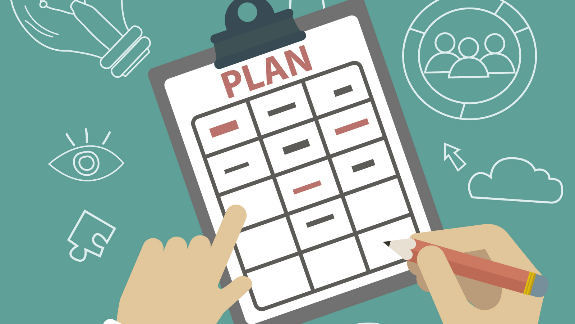
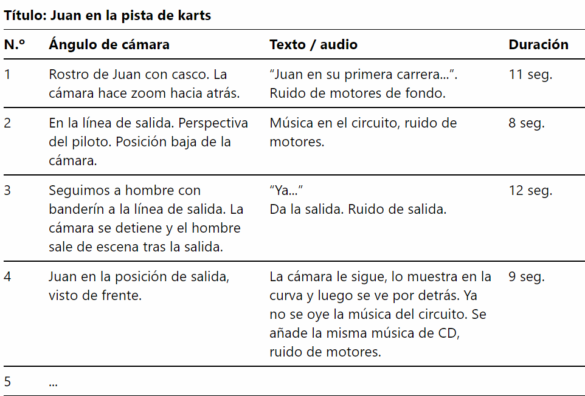

# 1. Planificación

Para crear nuestro vídeo, necesitaremos grabar varios trozos de vídeo (clips) en diferentes situaciones, lugares y momentos del día, por lo que necesitaremos el equipo adecuado para ello. Con tu smartphone es suficiente para grabar y editar y, si puedes, un PC para editar.

## Grabación de tomas

Deberás grabar al menos 10 situaciones diferentes que resuman cómo es tu día, desde su comienzo a su fin, a fin de luego realizar un montaje.

No hace falta que sean de más de 10 segundos cada una.

Para cada situación (por ejemplo, ir al instituto) realiza varias tomas, a fin de luego elegir una o mezclarlas.

Utiliza diferentes planos (primer plano, picado, contrapicado, general, plano detalle, etc.)

Intenta que no se vean caras de otras personas o compañeros o, en su defecto, pídeles permiso.

Puede ser de días diferentes.

Pon el móvil en horizontal

Al final deberás guardar todo en un ordenador para poder editarlo.

## Elaborar un plan de grabación

La primera tarea consiste en realizar un **plan de grabación**. Para ello, en un documento de Google Docs, deberás crear una tabla en la que aparezcan, ordenadas, las diferentes tomas que vais a realizar, y qué planos vais a utilizar. Es orientativo y no tiene por qué ser definitivo.

