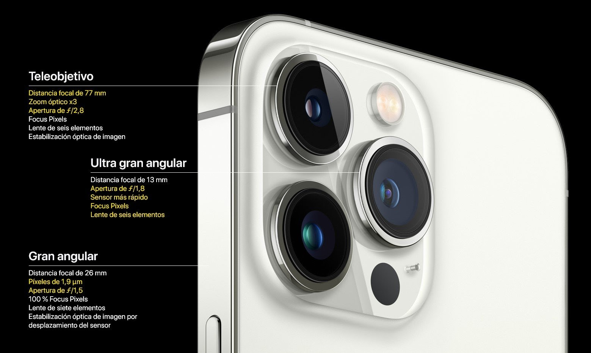
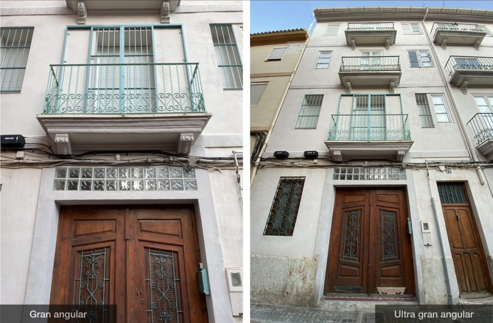

# Tipus de lents

Es fan servir en fotografia i videografia per capturar diferents **angles de visió**.

## Gran angular

Un gran angular es refereix a una lent amb una distància focal curta, cosa que permet capturar un angle de visió ampli. Això és útil per fer fotografies de paisatges, interiors d'edificis i altres entorns on es vol capturar una vista àmplia.

## Super gran angular

Un super gran angular és similar a un gran angular, però té una distància focal encara més curta, cosa que permet capturar un angle de visió encara més ampli. Això és útil per capturar paisatges panoràmics o per fer fotografies en espais petits on és difícil retrocedir per obtenir una vista àmplia.

## Teleobjectiu

Un teleobjectiu es refereix a una lent amb una distància focal llarga, cosa que permet apropar objectes llunyans i capturar detalls a llarga distància. Això és útil per fotografiar vida silvestre, esports i esdeveniments en viu, així com per crear imatges amb una profunditat de camp més estreta per aïllar el subjecte del fons.

## Diferencia entre angular y gran angular
El gran angular nos abrirá el campo de visión para que, de cerca, nos quepan más elementos en pantalla.

