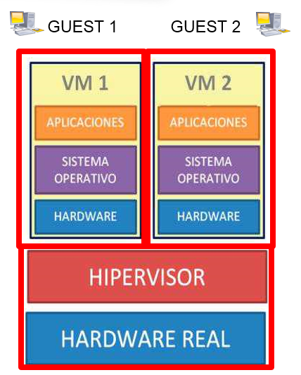

# 3.Componentes de la virtualizción

## Anfitrión (HOST)

Equipo sobre el que se ejecuta todo el sistema de virtualización

## Huésped (GUEST)

- Lo que se virtualiza sobre el anfitrión
- Lo más habitual suelen ser máquinas virtuales
- Sobre un HOST se pueden ejecutar 1 o más GUEST

## Hypervisor (VMM)

- Es el software que permite llevar a cabo la virtualización
- Me deja crear las máquinas virtuales, definirlas, manipularlas
- Ejemplo: virtualbox

En resumen, un anfitrión (HOST) es un equipo en el que se ejecuta un programa llamado Hypervisor (VMM) que permite crear y manipular máquinas virtuales (Huésped o GUEST). Estas máquinas virtuales son las que se ejecutan sobre el anfitrión. Un ejemplo de Hypervisor es Virtualbox.