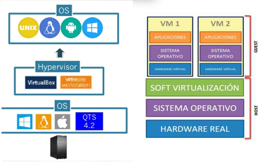

# 5. Tipos de hipervisor

## Tipo 1: Hipervisor alojado o hosted

 Un hipervisor alojado o hosted es un programa de virtualización que se ejecuta sobre el sistema operativo del host. Esta tecnología permite a los usuarios dividir un servidor físico en varias unidades lógicas, lo que permite la ejecución de varios sistemas operativos al mismo tiempo. Esto permite a los usuarios aprovechar al máximo el hardware existente, ahorrando en recursos y costos.host**

Los ejemplos más habituales de hipervisores de este tipo son:

- VMware
- Virtual PC (Microsoft)
- VirtualBox (Oracle)

## Tipo 2: Hipervisor nativo o bare metal

Un **hipervisor nativo o bare metal** es aquel que se instala y ejecuta directamente sobre el hardware del equipo, sin la necesidad de instalar un sistema operativo intermedio. Esto permite una mayor eficiencia y un mejor rendimiento para la máquina virtual que se ejecuta en el equipo.

- Ejemplos:
  - VMware ESX
  - Hyper-V (Microsoft)
  - Citrix XenServer
  - Oracle VM

