- [Configuración de un dominio de Windows con Virtualbox](#configuración-de-un-dominio-de-windows-con-virtualbox)
  - [1. Crear la máquina virtual de Windows XP](#1-crear-la-máquina-virtual-de-windows-xp)
    - [1.1. Configurar la máquina virtual](#11-configurar-la-máquina-virtual)
    - [1.2: Configurar almacenamiento y arranque](#12-configurar-almacenamiento-y-arranque)
    - [1.3. Instalación de Windows XP](#13-instalación-de-windows-xp)
  - [2. Crear la máquina virtual de Windows Server 2003](#2-crear-la-máquina-virtual-de-windows-server-2003)
    - [2.1. Configurar la máquina virtual](#21-configurar-la-máquina-virtual)
    - [2.2. Configurar almacenamiento y red](#22-configurar-almacenamiento-y-red)
    - [2.3. Instalación de Windows Server 2003](#23-instalación-de-windows-server-2003)
  - [3. Configuración de red en VirtualBox](#3-configuración-de-red-en-virtualbox)
    - [3.1. Configurar adaptadores de red en VirtualBox](#31-configurar-adaptadores-de-red-en-virtualbox)
  - [4. Configurar Windows Server 2003 (Servidor - IP Fija)](#4-configurar-windows-server-2003-servidor---ip-fija)
    - [4.1. Asignar IP en Windows Server 2003](#41-asignar-ip-en-windows-server-2003)
  - [5. Configurar Windows XP (Cliente - IP Manual o Automática)](#5-configurar-windows-xp-cliente---ip-manual-o-automática)
  - [6. Probar la conexión entre ambas máquinas](#6-probar-la-conexión-entre-ambas-máquinas)
    - [6.1. Probar conectividad con ping](#61-probar-conectividad-con-ping)
  - [7 Configuración del Controlador de Dominio en Windows Server 2003](#7-configuración-del-controlador-de-dominio-en-windows-server-2003)
  - [7.1. Instalar Active Directory:](#71-instalar-active-directory)
  - [7.2 Unión del Cliente Windows XP al Dominio](#72-unión-del-cliente-windows-xp-al-dominio)
  - [8. Creación y Gestión de Usuarios y Grupos](#8-creación-y-gestión-de-usuarios-y-grupos)
    - [8.1. Crear un usuario en Active Directory:](#81-crear-un-usuario-en-active-directory)
    - [8.2. Crear un grupo y agregar usuarios](#82-crear-un-grupo-y-agregar-usuarios)
  - [9: Creación y Configuración de Recursos Compartidos](#9-creación-y-configuración-de-recursos-compartidos)
    - [9.1. Crear una unidad de red compartida](#91-crear-una-unidad-de-red-compartida)
    - [9.2 Conectar la unidad de red en Windows XP](#92-conectar-la-unidad-de-red-en-windows-xp)
    - [9.1. Pruebas y Verificación](#91-pruebas-y-verificación)
  - [10.Asignación Automática de Unidad de Red con una GPO](#10asignación-automática-de-unidad-de-red-con-una-gpo)
    - [10.1. Crear y Configurar la GPO](#101-crear-y-configurar-la-gpo)
      - [Crear una nueva GPO](#crear-una-nueva-gpo)
      - [Editar la GPO](#editar-la-gpo)
      - [Configurar la Unidad de Red](#configurar-la-unidad-de-red)
      - [2. Aplicar la GPO y Verificar](#2-aplicar-la-gpo-y-verificar)
  - [11. Guest additions (opcional)](#11-guest-additions-opcional)
    - [¿Para qué sirven?](#para-qué-sirven)
    - [Cómo instalar las Guest Additions en Windows XP](#cómo-instalar-las-guest-additions-en-windows-xp)
    - [Pasar archivos](#pasar-archivos)

# Configuración de un dominio de Windows con Virtualbox

Lo tenéis instalado en todos los ordenadores.

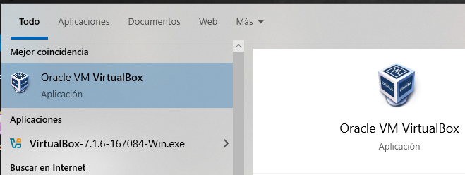

Con esta herramienta el objetivo es crear estas dos máquinas virtuales, y conectarlas entre ellas. En lugar de utilizar ordenadores reales, vamos a **emularlos** dentro de nuestro ordenador.

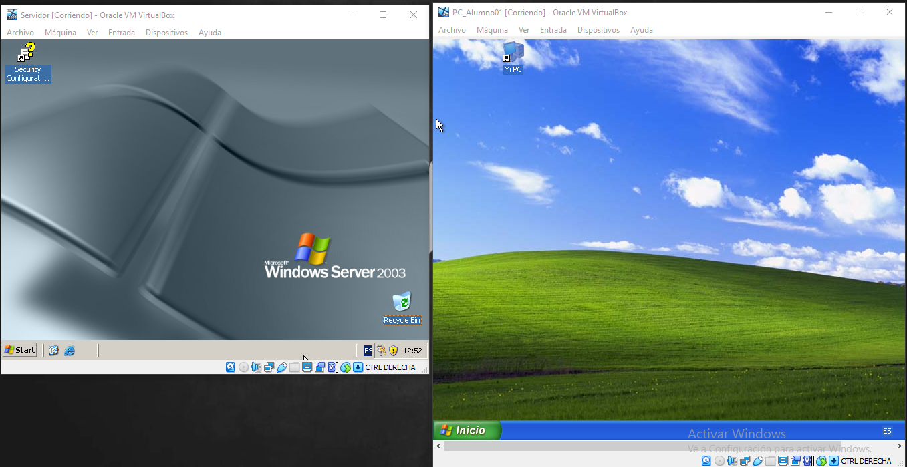

## 1. Crear la máquina virtual de Windows XP

La primera máquina que crearemos será un PC con Windows XP.

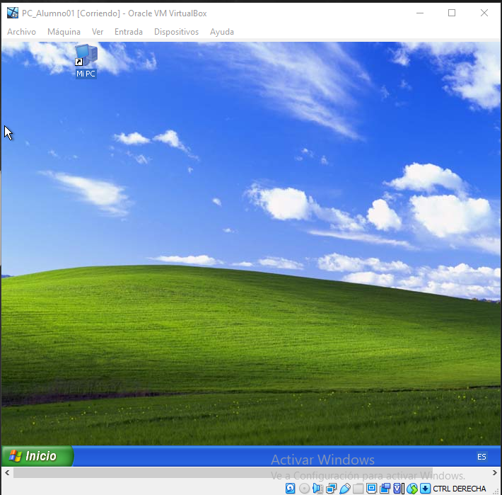

### 1.1. Configurar la máquina virtual

Abre VirtualBox y haz clic en "Nueva".

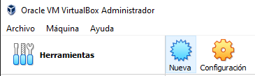

Entrar en modo experto:

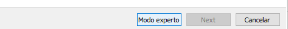

A continuación tenemos que decir qué características o componentes va a tener nuestra MV. Ello dependerá del sistema
operativo y programas que queramos que funcionen en él.

Para Windows XP, las opciones que marcaremos son:

- Nombre: Windows XP
- Tipo: Microsoft Windows
- Versión: Windows XP (32-bit)
- Memoria RAM: 512 MB - 1 GB (según lo que quieras probar).
- Disco duro: Crear uno nuevo (VDI, tamaño fijo, 10-20 GB).

### 1.2: Configurar almacenamiento y arranque

Seleccionando la máquina virtual, a la derecha seleccionamos IDE secundario
maestro, donde pone **Unidad óptica, Vacío**, con clic derecho de ratón:

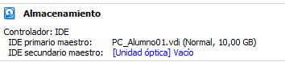

Seleccionar un archivo de disco:

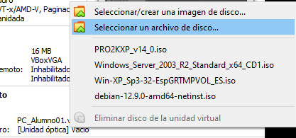

Seleccionamos el archivo ISO que queremos:

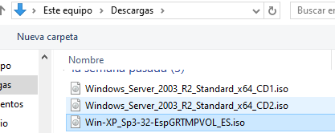

### 1.3. Instalación de Windows XP

Inicia la máquina y verás que al rato arranca desde
la unidad óptica.

Sigue los pasos del instalador de Windows XP.

Formatea el disco en **NTFS**.

Completa la instalación y configura usuario/contraseña.
Crea un usuario llamado **Alumno**  sin contraseña.

Clave Windows XP SP3: M8DPF-XT324-YBKK9-3VF8C-M2X78

## 2. Crear la máquina virtual de Windows Server 2003

Ahora vamos a crear una segunda MV y instalar Windows Server.
Esta máquina será nuestro **servidor**.

### 2.1. Configurar la máquina virtual

En VirtualBox, haz clic en "Nueva".

- Nombre: Windows Server 2003
- Tipo: Microsoft Windows
- Versión: Windows 2003 (32-bit)
- Memoria RAM: 256MB
- Disco duro: 2 GB

### 2.2. Configurar almacenamiento y red

- En "Almacenamiento", carga la ISO de Windows Server 2003 en el Controlador IDE.
- En "Red", usa el modo Red Interna si quieres conectar ambas máquinas entre sí.

### 2.3. Instalación de Windows Server 2003

- Arranca la máquina e inicia la instalación desde la ISO.

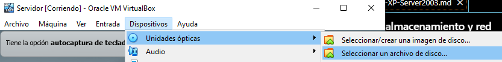

Sigue los pasos del instalador y selecciona **NTFS** como sistema de archivos.

Datos que necesitarás rellenar:

- Clave: ``VWMD9-2Q897-F427R-TV2KY-CRF2B``
- **administrator password**: 123456
- **Computer name**: SERVIDOR
- **Organization**: Vacío
- **Zona horaria**: +1 GMT

Tras reiniciar  la máquina virtual del servidor, iniciamos sesión:

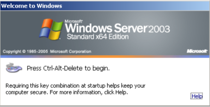

Para pulsar Ctrl+alt+supr en la máquina virtual clic derecho en el icono de la flecha y:

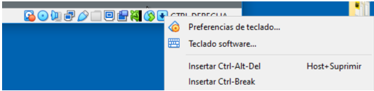

Iniciamos sesión como administrador:

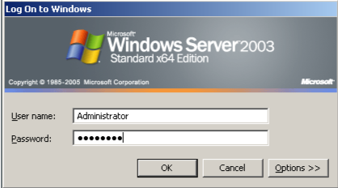

## 3. Configuración de red en VirtualBox

Antes de configurar las direcciones IP dentro de los sistemas operativos, debemos asegurarnos de que ambos usen la misma red interna en VirtualBox.

### 3.1. Configurar adaptadores de red en VirtualBox

- En VirtualBox, ve a **Configuración > Red** en cada máquina virtual.
- En el Adaptador 1, selecciona **Red Interna** y nómbrala (ejemplo: "**RedXP2003**").
- Asegúrate de hacer esto en ambas máquinas.

## 4. Configurar Windows Server 2003 (Servidor - IP Fija)

Dado que actuará como servidor de red, asignaremos una **IP fija**.

### 4.1. Asignar IP en Windows Server 2003

- Abre el **Panel de Control > Conexiones de red.**
- Haz clic derecho en **Conexión de área local > Propiedades.**
- Selecciona **Protocolo de Internet (TCP/IP) > Propiedades.**

Configura la siguiente IP:

- Dirección IP: 192.168.1.1
- Máscara de subred: 255.255.255.0
- Puerta de enlace predeterminada: (Vacío o misma IP del servidor si hay NAT)
- Servidor DNS preferido: 192.168.1.1 (o una IP de Google como 8.8.8.8)
- Guarda los cambios y cierra.

## 5. Configurar Windows XP (Cliente - IP Manual o Automática)

Windows XP puede recibir una IP por DHCP desde el servidor o configurarse manualmente.

**Configurar IP manualmente en XP**

- Ve a Panel de Control > Conexiones de red.
- Clic derecho en Conexión de área local > Propiedades.
- Selecciona Protocolo de Internet (TCP/IP) > Propiedades.

Configura:

 - Dirección IP: 192.168.1.2
 - Máscara de subred: 255.255.255.0
 - Puerta de enlace: 192.168.1.1
 - DNS preferido: 192.168.1.1

Guarda los cambios y prueba la conexión

## 6. Probar la conexión entre ambas máquinas

Después de configurar las IPs, verifica que pueden comunicarse:

### 6.1. Probar conectividad con ping

En Windows XP, abre Símbolo del sistema (cmd).

Escribe:

```bash
ping 192.168.1.1
```
Si responde, la conexión es correcta.
En Windows Server 2003, prueba:

```bash
ping 192.168.1.2
```

Si hay respuesta, ambas máquinas están conectadas correctamente.

## 7 Configuración del Controlador de Dominio en Windows Server 2003

Objetivo: Configurar un dominio en Windows Server 2003, unir un equipo con Windows XP y gestionar usuarios, grupos y recursos compartidos en la red.

## 7.1. Instalar Active Directory:

- Abre Ejecutar (Win + R), escribe ``dcpromo`` y presiona Enter.
- Selecciona "Controlador de dominio para un nuevo dominio".
- Elige "Dominio en un nuevo bosque".
- Introduce un nombre de dominio: ``aulainformatica.local``
- Configura una contraseña segura para el administrador de Active Directory.
- Completa la instalación y reinicia el servidor.

## 7.2 Unión del Cliente Windows XP al Dominio

En Windows XP, asigna una IP estática en la misma subred del servidor y usa la IP del servidor como DNS principal.

Unir al dominio:

- Ve a **Mi PC > Propiedades > Nombre de equipo > Cambiar**.
- Selecciona **Dominio**, introduce el nombre (aulainformatica.local) y presiona Aceptar.
- Introduce las credenciales del administrador del dominio cuando se soliciten.
- Reinicia el equipo.

## 8. Creación y Gestión de Usuarios y Grupos

### 8.1. Crear un usuario en Active Directory:

En el servidor, abre Usuarios y Equipos de Active Directory (``dsa.msc``).

- Dentro del dominio, haz clic derecho en **Usuarios > Nuevo > Usuario**.
- Crea el usuario **Juan Pérez** con nombre de usuario **jperez**.
- Asigna una contraseña y marca "El usuario debe cambiar la contraseña en el próximo inicio de sesión".

Contraseña provisional: **!1234567a**, y marcamos que el usuario debe cambiar la contraseña en el primer inicio de sesión.

Ahora ya tendremos el usuario creado:

### 8.2. Crear un grupo y agregar usuarios

- Dentro de Active Directory, ve a **Usuarios > Nuevo > Grupo**.
- Llama al grupo **Alumnos**.
- Abre las propiedades del grupo **Alumnos**  haciendo doble click en el nombre del grupo y añade el usuario **jperez**. Vamos a add:

Escribimos parte del nombre de usuario y le damos a check names:

Nos aparecerá el usuario y le damos a OK:

Ahora el grupo **Alumnos** tiene un **miembro**, el usuario **jperez**.

## 9: Creación y Configuración de Recursos Compartidos

### 9.1. Crear una unidad de red compartida

- En el servidor, crea una carpeta en ``C:\Recursos_Alumnos``.
- Haz **clic derecho > Propiedades > Compartir**.
- Activa la opción "Compartir esta carpeta" y nómbrala **Alumnos**.
- Ve a la pestaña **Seguridad** y otorga permisos de **lectura/escritura** sólo al grupo **Ventas**.

El grupo Users, que es más amplio, tiene permisos para acceder a esta carpeta, por lo que se los vamos a quitar:

### 9.2 Conectar la unidad de red en Windows XP

- En el cliente, abre Mi PC > Herramientas > Conectar a unidad de red.
- Escribe la ruta ``\\Servidor\Ventas`` y selecciona una letra (ejemplo: ``Z:``).
- Introduce las credenciales del dominio si lo solicita.
- Asegura que el usuario pueda acceder y escribir en la carpeta.

### 9.1. Pruebas y Verificación

- ✅ El usuario jperez puede iniciar sesión en el dominio desde Windows XP.
- ✅ El usuario jperez tiene acceso a la unidad de red Ventas.
- ✅ El usuario puede crear y modificar archivos en la carpeta compartida.
- ✅ Los permisos de grupo se aplican correctamente.

## 10.Asignación Automática de Unidad de Red con una GPO

Vamos a configurar una **Política de Grupo (GPO)** en Windows Server 2003 para asignar automáticamente la **unidad de red Alumnos (Z:)** a los usuarios del grupo Ventas.

### 10.1. Crear y Configurar la GPO

Abrir el **Editor de Políticas de Grupo**:

En el servidor, abre **Ejecutar** (Win + R), escribe ``gpedit.msc`` y presiona Enter.

Alternativamente, abre Usuarios y Equipos de Active Directory (``dsa.msc``), haz clic derecho en el dominio (aulainformatica.local) y selecciona **Propiedades > Directiva de Grupo**.

#### Crear una nueva GPO

En la ventana Directiva de Grupo, haz clic derecho en el dominio y selecciona **"Nueva directiva de grupo"**.
Nómbrala ``Asignación Unidad Alumnos``.

#### Editar la GPO

- Haz clic derecho sobre **Asignación Unidad Alummos** y selecciona **Editar**.
- Ve a: Configuración de usuario > Preferencias > Configuración de Windows > Asignaciones de unidad
- Haz clic derecho en **Asignaciones de unidad > Nuevo > Unidad de red**.

#### Configurar la Unidad de Red

En Ubicación, escribe la ruta del recurso compartido:

```bash
\\Servidor\Ventas
```

En Letra de unidad, selecciona Z:.

Marca la opción "Reconectar" para que la unidad se vuelva a mapear en cada inicio de sesión.

Filtrar la GPO para el grupo "Alumnos":

- Ve a la pestaña **Ámbito**.
- En **Seguridad**, haz clic en **Agregar > Usuarios o grupos.**
- Escribe **Alumnos**, selecciona el grupo y presiona Aceptar.

Asegúrate de que Ventas tiene activadas las opciones "Leer" y "Aplicar esta directiva de grupo".

#### 2. Aplicar la GPO y Verificar

Actualizar las Políticas en Windows XP:

En el cliente Windows XP, abre Símbolo del sistema (cmd) y ejecuta:

```
gpupdate /force
```

Reinicia el equipo.

Iniciar sesión con un **usuario** del grupo **Alumnos** y comprobar:

Abre **Mi PC** y verifica si aparece la **unidad Z:** conectada automáticamente.

Intenta crear y modificar archivos en la carpeta para verificar permisos.

Si todo va bien:

- ✅ Los usuarios del **grupo Alumnos** tendrán la unidad **z:** asignada automáticamente al iniciar sesión.
- ✅ La configuración se aplicará sin necesidad de que los usuarios la configuren manualmente.

Extras (Opcionales)

- 🔹 Aplicar la GPO solo a ciertos equipos dentro del dominio.
- 🔹 Configurar una GPO de Inicio de Sesión con un script net use Z: \\Servidor\Ventas.
- 🔹 Usar gpresult /R en Windows XP para verificar si la GPO se aplica correctamente.
- Este método ayuda a automatizar la administración de recursos en un dominio de Windows Server 2003. 🚀

## 11. Guest additions (opcional)

Las Guest Additions (o "Adiciones para invitados") son un conjunto de controladores y herramientas que mejoran la integración entre la máquina virtual (MV) y el sistema anfitrión en VirtualBox.

### ¿Para qué sirven?

Cuando las instalas en la MV, obtienes beneficios como:

- ✅ Mejor rendimiento gráfico (drivers de video para resoluciones altas).
- ✅ Compartir el portapapeles entre la MV y el anfitrión.
- ✅ Arrastrar y soltar archivos entre la MV y el sistema real.
- ✅ Carpetas compartidas para intercambiar archivos fácilmente.
- ✅ Mejor compatibilidad con periféricos (ratón, teclado, red, etc.).

### Cómo instalar las Guest Additions en Windows XP

- 1️⃣ Enciende la MV y entra en Windows XP.
- 2️⃣ En la ventana de VirtualBox, ve a Dispositivos > Insertar imagen de CD de las Guest Additions.
- 3️⃣ Se montará un CD virtual dentro de la MV. Abre Mi PC y accede a la unidad de CD.
- 4️⃣ Ejecuta VBoxWindowsAdditions.exe y sigue los pasos del instalador.
- 5️⃣ Cuando termine, reinicia la MV para aplicar los cambios.

### Pasar archivos

Para pasar archivos entre tu máquina real y la virtual en VirtualBox 6, tienes varias opciones:

🔹 1. Carpetas Compartidas (Recomendado)
Si necesitas transferir archivos con frecuencia, esta opción es la mejor.

🔹 Cómo configurar una carpeta compartida:

- 1️⃣ Apaga la máquina virtual (MV).
- 2️⃣ En VirtualBox, selecciona la MV y ve a Configuración > Carpetas compartidas.
- 3️⃣ Haz clic en Agregar carpeta nueva (icono de carpeta con un "+" a la derecha).
- 4️⃣ En Ruta de carpeta, selecciona una carpeta de tu máquina real.
- 5️⃣ Marca Montaje automático y Hacer permanente (para que no desaparezca al reiniciar).
- 6️⃣ Guarda y enciende la MV.

🔹 Acceder a la carpeta en Windows XP:
En la MV, abre Mi PC > Unidad de red (o ve a \\VBOXSVR\ en el Explorador de archivos).

Ahí verás la carpeta compartida con tu máquina real.

💡 Si no aparece, prueba instalando las Guest Additions como mencioné antes.

🔹 2. Arrastrar y Soltar (Solo si Guest Additions está instalado)
Si tienes las Guest Additions instaladas, activa la opción en Configuración > General > Avanzado.

Elige Bidireccional para que funcione en ambos sentidos.

Ahora puedes arrastrar y soltar archivos directamente entre el anfitrión y la MV.

⚠️ Esta opción a veces no funciona bien en Windows XP.

🔹 3. Usar una Unidad USB
Si tienes un pendrive, puedes conectarlo a la MV.
1️⃣ En Configuración > USB, habilita el Controlador USB 2.0 o 3.0.
2️⃣ Agrega tu dispositivo USB desde el icono de "Agregar filtro".
3️⃣ Cuando inicies la MV, tu Windows XP debería reconocer el pendrive.

🔹 4. Montar una Imagen ISO
Si tienes varios archivos, puedes crear una imagen ISO y montarla en la MV:
1️⃣ Usa un programa como ImgBurn o PowerISO para crear la ISO en la máquina real.
2️⃣ En VirtualBox, ve a Configuración > Almacenamiento y agrega la ISO en la unidad de CD.
3️⃣ Dentro de Windows XP, abre el CD y extrae los archivos.

🔹 5. Servidor FTP o Compartición en Red
Si ambas máquinas están en la misma red, puedes:

Compartir una carpeta en la red y acceder desde XP.

Montar un servidor FTP en la máquina real y descargar desde XP con un cliente FTP (como FileZilla).

🔥 ¿Cuál es la mejor opción?
🔹 Si transfieres archivos frecuentemente: Carpetas compartidas.
🔹 Si son archivos pequeños y ocasionales: Arrastrar y soltar (si funciona).
🔹 Si prefieres un método clásico: USB o ISO.
🔹 Si quieres algo avanzado: Compartición de red o FTP.
