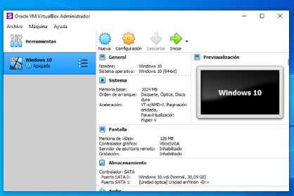

- [Configuración de un dominio de Windows con Virtualbox](#configuración-de-un-dominio-de-windows-con-virtualbox)
  - [1. Crear la máquina virtual de Windows XP](#1-crear-la-máquina-virtual-de-windows-xp)
  - [2. Crear la máquina virtual de Windows Server 2003](#2-crear-la-máquina-virtual-de-windows-server-2003)
  - [2. Crear la máquina virtual de Windows Server 2003](#2-crear-la-máquina-virtual-de-windows-server-2003-1)
- [3. Configuración de red en VirtualBox](#3-configuración-de-red-en-virtualbox)
  - [3.1. Configurar adaptadores de red en VirtualBox](#31-configurar-adaptadores-de-red-en-virtualbox)
- [4. Configurar Windows Server 2003 (Servidor - IP Fija)](#4-configurar-windows-server-2003-servidor---ip-fija)
  - [4.1. Asignar IP en Windows Server 2003](#41-asignar-ip-en-windows-server-2003)
  - [5. Configurar Windows XP (Cliente - IP Manual o Automática)](#5-configurar-windows-xp-cliente---ip-manual-o-automática)
  - [6. Probar la conexión entre ambas máquinas](#6-probar-la-conexión-entre-ambas-máquinas)
  - [7. Configuración del Controlador de Dominio en Windows Server 2003](#7-configuración-del-controlador-de-dominio-en-windows-server-2003)
  - [8. Creación y Gestión de Usuarios y Grupos](#8-creación-y-gestión-de-usuarios-y-grupos)
- [9. Creación y Configuración de Recursos Compartidos](#9-creación-y-configuración-de-recursos-compartidos)
  - [9.1. Crear una unidad de red compartida](#91-crear-una-unidad-de-red-compartida)
  - [9.2. Conectar la unidad de red en Windows XP](#92-conectar-la-unidad-de-red-en-windows-xp)
  - [9.3. Pruebas y Verificación](#93-pruebas-y-verificación)
  - [10. Asignación Automática de Unidad de Red con una GPO](#10-asignación-automática-de-unidad-de-red-con-una-gpo)
  - [11. Guest additions (opcional)](#11-guest-additions-opcional)

# Configuración de un dominio de Windows con Virtualbox

En esta práctica, configuraremos un dominio de Windows utilizando máquinas virtuales en **VirtualBox**.

Para ello, crearemos dos máquinas virtuales que actuarán como los equipos de una red:

- **Servidor**: Ejecutará **Windows Server 2003** y funcionará como **Controlador de Dominio**.
- **Cliente**: Ejecutará **Windows XP** y se unirá al dominio administrado por el servidor.

Estas máquinas virtuales simularán una pequeña red dentro de nuestro ordenador, permitiéndonos experimentar con la configuración y gestión de un dominio de Windows de manera práctica.



## 1. Crear la máquina virtual de Windows XP

### 1.1. Configurar la máquina virtual

1. Abre **VirtualBox** y haz clic en **"Nueva"**.

   

2. Completa los siguientes campos:
   - **Nombre:** Windows XP
   - **Tipo:** Microsoft Windows
   - **Versión:** Windows XP (32-bit)

3. Asigna la cantidad de **memoria RAM**, recomendada entre **512 MB y 1 GB**, dependiendo de los recursos disponibles en tu equipo.

4. En la sección de **disco duro**, selecciona **"Crear un disco virtual nuevo"** y configúralo de la siguiente manera:
   - **Tipo de archivo:** VDI (Virtual Disk Image)
   - **Almacenamiento:** Tamaño fijo (mejor rendimiento)
   - **Tamaño:** Entre **10 y 20 GB**.

5. Finaliza la configuración y haz clic en **"Crear"**.

### 1.2. Configurar la unidad óptica

1. Selecciona la máquina virtual creada.
2. A la derecha, busca la opción **IDE sundario maestro**, donde aparece **Unidad óptica: Vacío**.
3. Haz **clic derecho** sobre **Vacío**.

   

4. Selecciona **"Seleccionar un archivo de disco"**.

   

5. Escoge el archivo **ISO** de Windows XP.

   

### 1.3. Instalación de Windows XP

1. Inicia la máquina virtual.
2. Espera unos instantes hasta que arranque desde la unidad óptica.
3. Sigue los pasos del instalador de Windows XP.
4. Formatea el disco en **NTFS**.
5. Completa la instalación y confura usuario/contraseña:
   - **Usuario:** Alumno
   - **Contraseña:** (deJAr en blanco)
6. Introduce la siguiente clave de Winws XP SP3 cuando se solicite:

Clave Windows XP SP3: M8DPF-XT324-YBKK9-3VF8C-M2X78

## 2. Crear la máquina virtual de Windows Server 2003

Ahora vamos a crear una segunda máquina virtual para instalar **Windows Server 2003**.
Esta máquina actuará como nuestro **servidor** dentro del dominio.

### 2.1. Configurar la máquina virtual

1. Abre **VirtualBox** y haz clic en **"Nueva"**.
2. Completa los siguientes campos:
   - **Nombre:** Windows Server 2003
   - **Tipo:** Microsoft Windows
   - **Versión:** Windows 2003 (32-bit)
3. Asigna **256 MB de memoria RAM**.
4. En la sección de **disco duro**, selecciona **"Crear un disco virtual nuevo"** y configúralo de la siguiente manera:
   - **Tipo de archivo:** VDI (Virtual Disk Image)
   - **Almacenamiento:** Tamaño fijo (mejor rendimiento)
   - **Tamaño:** 2 GB

Una vez configurado, haz clic en **"Crear"** para finalizar.

## 2. Crear la máquina virtual de Windows Server 2003

Ahora vamos a crear una segunda máquina virtual para instalar **Windows Server 2003**.
Esta máquina actuará como nuestro **servidor** dentro del dominio.

### 2.1. Configurar la máquina virtual

1. Abre **VirtualBox** y haz clic en **"Nueva"**.
2. Completa los siguientes campos:
   - **Nombre:** Windows Server 2003
   - **Tipo:** Microsoft Windows
   - **Versión:** Windows 2003 (32-bit)
3. Asigna **256 MB de memoria RAM**.
4. En la sección de **disco duro**, selecciona **"Crear un disco virtual nuevo"** y configúralo de la siguiente manera:
   - **Tipo de archivo:** VDI (Virtual Disk Image)
   - **Almacenamiento:** Tamaño fijo (mejor rendimiento)
   - **Tamaño:** 2 GB

Una vez configurado, haz clic en **"Crear"** para finalizar.

### 2.2. Configurar almacenamiento y red

1. En la configuración de la máquina virtual, accede a la sección **"Almacenamiento"**.
2. Carga la **ISO de Windows Server 2003** en el **Controlador IDE**.
3. En **"Red"**, selecciona **"Modo Red Interna"** si deseas conectar ambas máquinas entre sí.

### 2.3. Instalación de Windows Server 2003

1. Arranca la máquina virtual e inicia la instalación desde la **ISO**.

   

2. Sigue los pasos del instalador y selecciona **NTFS** como sistema de archivos.
3. Completa la instalación con los siguientes datos:

   - **Clave de producto:**
     ```
     VWMD9-2Q897-F427R-TV2KY-CRF2B
     ```
   - **Contraseña del administrador:** `123456`
   - **Nombre del equipo:** `SERVIDOR`
   - **Organización:** (dejar en blanco)
   - **Zona horaria:** `GMT +1`

4. Tras reiniciar la máquina virtual del servidor, inicia sesión:

   

5. Para enviar `Ctrl + Alt + Supr` dentro de la máquina virtual:
   - Haz **clic derecho** en el icono de la flecha y selecciona la opción correspondiente.

   

6. Inicia sesión como **Administrador**:

   

# 3. Configuración de red en VirtualBox

Antes de configurar las direcciones IP dentro de los sistemas operativos, debemos asegurarnos de que ambas máquinas virtuales estén conectadas a la misma **red interna** en VirtualBox.

## 3.1. Configurar adaptadores de red en VirtualBox

1. Abre **VirtualBox** y selecciona cada máquina virtual.
2. Ve a **Configuración > Red**.
3. En el **Adaptador 1**, selecciona **Red Interna**.
4. Asigna un nombre a la red interna (por ejemplo, `"RedXP2003"`).
5. Asegúrate de repetir estos pasos en ambas máquinas.

# 4. Configurar Windows Server 2003 (Servidor - IP Fija)

Dado que el servidor actuará como el controlador de la red, debemos asignarle una **IP fija**.

## 4.1. Asignar IP en Windows Server 2003

1. Abre **Panel de Control > Conexiones de red**.
2. Haz **clic derecho** en **Conexión de área local** y selecciona **Propiedades**.
3. En la lista de componentes, selecciona **Protocolo de Internet (TCP/IP)** y haz clic en **Propiedades**.
4. Configura los siguientes valores:

   - **Dirección IP:** `192.168.1.1`
   - **Máscara de subred:** `255.255.255.0`
   - **Puerta de enlace predeterminada:** *(Vacío o la misma IP del servidor si hay NAT)*
   - **Servidor DNS preferido:** `192.168.1.1` *(o una IP de Google como `8.8.8.8` si se necesita acceso externo)*

5. Guarda los cambios y cierra la ventana.

## 5. Configurar Windows XP (Cliente - IP Manual o Automática)

Windows XP puede obtener una IP automáticamente a través de **DHCP** o configurarse con una **IP manual**.

### 5.1. Configurar IP manualmente en Windows XP

1. Abre **Panel de Control > Conexiones de red**.
2. Haz **clic derecho** en **Conexión de área local** y selecciona **Propiedades**.
3. Selecciona **Protocolo de Internet (TCP/IP)** y haz clic en **Propiedades**.
4. Ingresa los siguientes valores:

   - **Dirección IP:** `192.168.1.2`
   - **Máscara de subred:** `255.255.255.0`
   - **Puerta de enlace:** `192.168.1.1`
   - **Servidor DNS preferido:** `192.168.1.1`

## 6. Probar la conexión entre ambas máquinas

Después de configurar las direcciones IP, es importante verificar que ambas máquinas pueden comunicarse entre sí.

### 6.1. Probar conectividad con `ping`

#### Desde Windows XP

1. Abre **Símbolo del sistema** (`cmd`).
2. Escribe el siguiente comando y presiona **Enter**:

```bash
ping 192.168.1.1
```

Si recibes respuestas, significa que la conexión con el servidor es correcta.

#### Desde Windows Server 2003

1. Abre Símbolo del sistema (cmd).
2. Escribe el siguiente comando y presiona Enter:

```
ping 192.168.1.2
```

3. Si hay respuesta, ambas máquinas están conectadas correctamente.

Si alguna máquina no responde, revisa la configuración de red y asegúrate de que el firewall no esté bloqueando las conexiones.

## 7. Configuración del Controlador de Dominio en Windows Server 2003

Objetivo: Configurar un dominio en Windows Server 2003, unir un equipo con Windows XP y gestionar usuarios, grupos y recursos compartidos en la red.

### 7.1. Instalar Active Directory

1. Abre **Ejecutar** (Win + R), escribe `dcpromo` y presiona **Enter**.
2. Selecciona **"Controlador de dominio para un nuevo dominio"**.
3. Elige **"Dominio en un nuevo bosque"**.
4. Introduce un nombre de dominio: `aulainformatica.local`.
5. Configura una **contraseña segura** para el administrador de Active Directory.
6. Completa la instalación y reinicia el servidor.

### 7.2. Unión del Cliente Windows XP al Dominio

1. En **Windows XP**, asigna una IP estática en la misma subred del servidor y usa la IP del servidor como **DNS principal**.
2. Para unir al dominio:
   - Ve a **Mi PC > Propiedades > Nombre de equipo > Cambiar**.
   - Selecciona **Dominio**, introduce el nombre del dominio (`aulainformatica.local`) y presiona **Aceptar**.
   - Introduce las **credenciales** del administrador del dominio cuando se soliciten.
3. **Reinicia el equipo**.

## 8. Creación y Gestión de Usuarios y Grupos

### 8.1. Crear un usuario en Active Directory

1. En el servidor, abre **Usuarios y Equipos de Active Directory** (`dsa.msc`).
2. Dentro del dominio, haz clic derecho en **Usuarios > Nuevo > Usuario**.
3. Crea el usuario **Juan Pérez** con el nombre de usuario `jperez`.
4. Asigna una **contraseña provisional**: `!1234567a` y marca la opción **"El usuario debe cambiar la contraseña en el próximo inicio de sesión"**.
5. Haz clic en **Siguiente** y luego en **Finalizar**.

Ahora ya tendremos el usuario creado.

### 8.2. Crear un grupo y agregar usuarios

1. Dentro de Active Directory, ve a **Usuarios > Nuevo > Grupo**.
2. Llama al grupo **Alumnos**.
3. Abre las **propiedades del grupo** **Alumnos** haciendo doble clic en el nombre del grupo.
4. Haz clic en **Miembros** y luego en **Agregar**.
5. Escribe el nombre del usuario (`jperez`), haz clic en **Comprobar nombres** y luego en **Aceptar**.

Ahora el grupo **Alumnos** tiene un **miembro**, el usuario **jperez**.

# 9. Creación y Configuración de Recursos Compartidos

## 9.1. Crear una unidad de red compartida

1. En el servidor, crea una carpeta en `C:\Recursos_Alumnos`.
2. Haz **clic derecho > Propiedades > Compartir**.
3. Activa la opción **"Compartir esta carpeta"** y nómbrala **Alumnos**.
4. Ve a la pestaña **Seguridad** y otorga permisos de **lectura/escritura** solo al grupo **Ventas**.

El grupo **Users**, que es más amplio, tiene permisos para acceder a esta carpeta, por lo que vamos a quitar esos permisos.

## 9.2. Conectar la unidad de red en Windows XP

1. En el cliente, abre **Mi PC > Herramientas > Conectar a unidad de red**.
2. Escribe la ruta `\\Servidor\Alumnos` y selecciona una letra (por ejemplo, `Z:`).
3. Introduce las **credenciales del dominio** si lo solicita.
4. Asegúrate de que el usuario pueda acceder y escribir en la carpeta.

## 9.3. Pruebas y Verificación

- ✅ El usuario `jperez` puede iniciar sesión en el dominio desde Windows XP.
- ✅ El usuario `jperez` tiene acceso a la unidad de red **Alumnos**.
- ✅ El usuario puede crear y modificar archivos en la carpeta compartida.
- ✅ Los permisos de grupo se aplican correctamente.

## 10. Asignación Automática de Unidad de Red con una GPO

Vamos a configurar una **Política de Grupo (GPO)** en Windows Server 2003 para asignar automáticamente la **unidad de red Alumnos (Z:)** a los usuarios del grupo **Ventas**.

### 10.1. Crear y Configurar la GPO

1. **Abrir el Editor de Políticas de Grupo**:
   - En el servidor, abre **Ejecutar** (Win + R), escribe `gpedit.msc` y presiona **Enter**.
   - Alternativamente, abre **Usuarios y Equipos de Active Directory** (`dsa.msc`), haz clic derecho en el dominio (**aulainformatica.local**) y selecciona **Propiedades > Directiva de Grupo**.

2. **Crear una nueva GPO**:
   - En la ventana de **Directiva de Grupo**, haz clic derecho en el dominio y selecciona **"Nueva directiva de grupo"**.
   - Nómbrala `Asignación Unidad Alumnos`.

3. **Editar la GPO**:
   - Haz clic derecho sobre **Asignación Unidad Alumnos** y selecciona **Editar**.
   - Ve a: **Configuración de usuario > Preferencias > Configuración de Windows > Asignaciones de unidad**.
   - Haz clic derecho en **Asignaciones de unidad > Nuevo > Unidad de red**.

#### Configurar la Unidad de Red

1. En **Ubicación**, escribe la ruta del recurso compartido:

    ```bash
    \\Servidor\Ventas
    ```

2. En **Letra de unidad**, selecciona **Z:**.

3. Marca la opción **"Reconectar"** para que la unidad se vuelva a mapear en cada inicio de sesión.

#### Filtrar la GPO para el grupo "Alumnos":

1. Ve a la pestaña **Ámbito**.
2. En **Seguridad**, haz clic en **Agregar > Usuarios o grupos**.
3. Escribe **Alumnos**, selecciona el grupo y presiona **Aceptar**.

Asegúrate de que el grupo **Ventas** tiene activadas las opciones **"Leer"** y **"Aplicar esta directiva de grupo"**.

#### 2. Aplicar la GPO y Verificar

#### 2. Aplicar la GPO y Verificar

1. **Actualizar las Políticas en Windows XP**:

   En el cliente Windows XP, abre **Símbolo del sistema (cmd)** y ejecuta:

   ```bash
   gpupdate /force
   ```

2. Reinicia el equipo.
3. Iniciar sesión con un usuario del grupo Alumnos y comprobar:

- Abre Mi PC y verifica si aparece la unidad Z: conectada automáticamente.
- Intenta crear y modificar archivos en la carpeta para verificar permisos.

Si todo va bien:

- ✅ Los usuarios del grupo Alumnos tendrán la unidad Z: asignada automáticamente al iniciar sesión.
- ✅ La configuración se aplicará sin necesidad de que los usuarios la configuren manualmente.

#### Extras (Opcionales)

- 🔹 Aplicar la GPO solo a ciertos equipos dentro del dominio.
- 🔹 Configurar una GPO de Inicio de Sesión con un script net use Z: \\Servidor\Ventas.
- 🔹 Usar gpresult /R en Windows XP para verificar si la GPO se aplica correctamente.

Este método ayuda a automatizar la administración de recursos en un dominio de Windows Server 2003

## 11. Guest additions (opcional)

Las Guest Additions (o "Adiciones para invitados") son un conjunto de controladores y herramientas que mejoran la integración entre la máquina virtual (MV) y el sistema anfitrión en VirtualBox.

### ¿Para qué sirven?

Cuando las instalas en la MV, obtienes beneficios como:

- ✅ Mejor rendimiento gráfico (drivers de video para resoluciones altas).
- ✅ Compartir el portapapeles entre la MV y el anfitrión.
- ✅ Arrastrar y soltar archivos entre la MV y el sistema real.
- ✅ Carpetas compartidas para intercambiar archivos fácilmente.
- ✅ Mejor compatibilidad con periféricos (ratón, teclado, red, etc.).

### Cómo instalar las Guest Additions en Windows XP

- 1️⃣ Enciende la MV y entra en Windows XP.
- 2️⃣ En la ventana de VirtualBox, ve a Dispositivos > Insertar imagen de CD de las Guest Additions.
- 3️⃣ Se montará un CD virtual dentro de la MV. Abre Mi PC y accede a la unidad de CD.
- 4️⃣ Ejecuta VBoxWindowsAdditions.exe y sigue los pasos del instalador.
- 5️⃣ Cuando termine, reinicia la MV para aplicar los cambios.

### Pasar archivos

Para pasar archivos entre tu máquina real y la virtual en VirtualBox 6, tienes varias opciones:

🔹 1. Carpetas Compartidas (Recomendado)
Si necesitas transferir archivos con frecuencia, esta opción es la mejor.

🔹 Cómo configurar una carpeta compartida:

- 1️⃣ Apaga la máquina virtual (MV).
- 2️⃣ En VirtualBox, selecciona la MV y ve a Configuración > Carpetas compartidas.
- 3️⃣ Haz clic en Agregar carpeta nueva (icono de carpeta con un "+" a la derecha).
- 4️⃣ En Ruta de carpeta, selecciona una carpeta de tu máquina real.
- 5️⃣ Marca Montaje automático y Hacer permanente (para que no desaparezca al reiniciar).
- 6️⃣ Guarda y enciende la MV.

🔹 Acceder a la carpeta en Windows XP:
En la MV, abre Mi PC > Unidad de red (o ve a \\VBOXSVR\ en el Explorador de archivos).

Ahí verás la carpeta compartida con tu máquina real.

💡 Si no aparece, prueba instalando las Guest Additions como mencioné antes.

🔹 2. Arrastrar y Soltar (Solo si Guest Additions está instalado)
Si tienes las Guest Additions instaladas, activa la opción en Configuración > General > Avanzado.

Elige Bidireccional para que funcione en ambos sentidos.

Ahora puedes arrastrar y soltar archivos directamente entre el anfitrión y la MV.

⚠️ Esta opción a veces no funciona bien en Windows XP.

🔹 3. Usar una Unidad USB
Si tienes un pendrive, puedes conectarlo a la MV.
1️⃣ En Configuración > USB, habilita el Controlador USB 2.0 o 3.0.
2️⃣ Agrega tu dispositivo USB desde el icono de "Agregar filtro".
3️⃣ Cuando inicies la MV, tu Windows XP debería reconocer el pendrive.

🔹 4. Montar una Imagen ISO
Si tienes varios archivos, puedes crear una imagen ISO y montarla en la MV:
1️⃣ Usa un programa como ImgBurn o PowerISO para crear la ISO en la máquina real.
2️⃣ En VirtualBox, ve a Configuración > Almacenamiento y agrega la ISO en la unidad de CD.
3️⃣ Dentro de Windows XP, abre el CD y extrae los archivos.

🔹 5. Servidor FTP o Compartición en Red
Si ambas máquinas están en la misma red, puedes:

Compartir una carpeta en la red y acceder desde XP.

Montar un servidor FTP en la máquina real y descargar desde XP con un cliente FTP (como FileZilla).

🔥 ¿Cuál es la mejor opción?
🔹 Si transfieres archivos frecuentemente: Carpetas compartidas.
🔹 Si son archivos pequeños y ocasionales: Arrastrar y soltar (si funciona).
🔹 Si prefieres un método clásico: USB o ISO.
🔹 Si quieres algo avanzado: Compartición de red o FTP.
