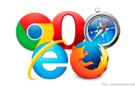
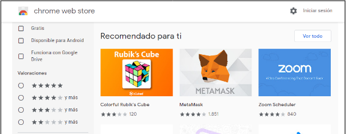
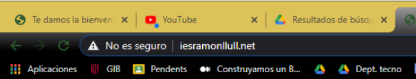
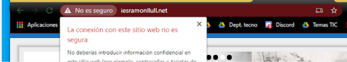
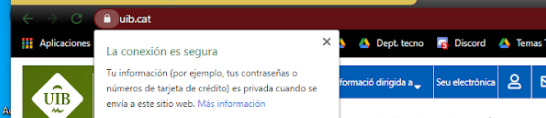
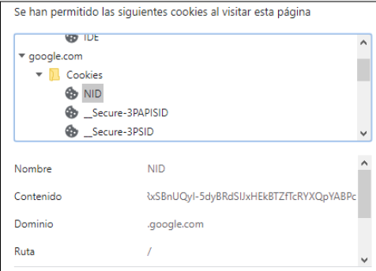

# Introducció

En aquest tema farem una introducció a la creació web, amb un poc de HTML inicial i realització de pàgines web a nivell visual. També es treballen  fulls d’estil, javascript y disseny responsive

- Pàgines web. Lloc web (website), tipus de pàgines (estàtiques i dinàmiques)
- Hipertext.

## Navegadors

Per accedir a les pàgines web fem servir un navegador, que s'encarrega de comunicar el nostre ordinador amb el servidor que allotja la pàgina web. N'hi ha per a Windows, MAC OS o en forma d'aplicacions mòbils.

Els més habituals són:

- [Google Chrome](https://www.google.com/intl/ca/chrome/)
- [Microsoft Edge (abans Internet Explorer)](https://www.microsoft.com/ca-es/edge)
- [Mozilla Firefox](https://www.mozilla.org/ca/firefox/)
- [Safari](https://www.apple.com/safari/)
- [Opera](https://www.opera.com/ca)

## Extensiones

Els navegadors són personalitzables gràcies a les extensions o complements, petits programes que podem descarregar i que s'instal·len dins del navegador per ampliar-ne les funcionalitats. Per instal·lar-les, cal accedir al mercat corresponent des del navegador que fem servir.

Aquí teniu els enllaços als mercats d'extensions més habituals:

- [Extensions de Google Chrome](https://chrome.google.com/webstore/category/extensions)
- [Complements de Mozilla Firefox](https://addons.mozilla.org/ca/firefox/)
- [Chrome Web Store](https://chrome.google.com/webstore)

## Adreces URL, HTTP i HTTPS

## La dirección o URL

A menudo buscamos información en Google directamente y, a partir de ahí, navegamos de página en página, abriendo diferentes enlaces, hasta encontrar aquello que buscamos.
Realmente, cada página tiene una dirección única a nivel mundial, como la dirección de tu casa. Esta dirección se llama URL:

- La dirección URL del instituto es: http://www.iesramonllull.net/. Cualquiera que escriba esto en la barra de direcciones, llegará a la página del instituto, desde cualquier lugar del mundo.
- La URL comienza siempre por http://, aunque si no se pone funciona igualmente.

## HTTPS

Esta dirección indica el sitio web y la ruta hacia la página concreta: https://www.marca.com/baloncesto/nba.html
Te habrás dado cuenta que empieza por HTTPS y no HTTP. Eso significa que es una conexión segura y encriptada, por lo que nadie podría ver lo que estás enviando a esta página web, entre otras cosas.
⚠️ Fíjate siempre que las páginas que visites comiencen por HTTPS.
Ejemplo de página no segura

Ejemplo de página segura

## Cookies

Las cookies son pequeños trozos de información que las webs guardan en nuestro ordenador, a modo de recordar cosas sobre nosotros la siguiente vez que nos conectemos a ella u otras páginas. Pinchando en el candado que aparece al lado de la dirección URL, podemos ver la información de cookies para esta página.

Hoy en día es obligatorio que cualquier sitio web nos informe sobre qué información almacena en cookies y para qué, y somos nosotros si permitimos o no usarlas.

### Ejemplo de cookies en``YouTube``

En Google utilizamos cookies y otros datos para proporcionar, mantener y mejorar nuestros servicios y anuncios. Si aceptas, personalizaremos el contenido y los anuncios que ves en función de tu actividad en nuestros servicios, como la Búsqueda, Maps o``YouTube``. También contamos con partners que miden cómo se usan nuestros servicios. Haz clic en "Ver más" para consultar tus opciones o visita g.co/privacytools en cualquier momento.

## Editors de pàgines web

- **Editors de text**
  Aquests editors permeten escriure codi directament, oferint funcionalitats com l'auto-completat o la coloració sintàctica per facilitar la programació.
  - [Brackets](http://brackets.io/)
  - [Sublime Text](https://www.sublimetext.com/)
  - [Atom (ja discontinuat)](https://atom.io/)

- **Editors visuals WYSIWYG**
  Els editors WYSIWYG (What You See Is What You Get) permeten crear pàgines web de manera visual sense necessitat de conèixer codi, ja que mostren el resultat final mentre es construeix.
  - [Kompozer](https://kompozer.net/)

- **Entorns IDE (Integrated Development Environment)**
  Els entorns IDE són eines més avançades que proporcionen eines integrades per a la programació, depuració i gestió de projectes. Són ideals per a desenvolupadors que treballen amb projectes grans o complexos.
  - [Visual Studio Code (VS Code)](https://code.visualstudio.com/)

- **Gestors de continguts (CMS)**
  Els CMS són plataformes que permeten crear i gestionar pàgines web dinàmiques de forma més senzilla, sense haver de programar directament.
  - [Joomla](https://www.joomla.org/)
  - [WordPress](https://wordpress.org/)

- **Eines de creació en línia**
  Aquestes eines permeten crear pàgines web directament des del navegador, sense instal·lar cap programari addicional. Són ideals per a usuaris que volen resultats ràpids i senzills.
  - [Google Sites](https://sites.google.com/)

## Llenguatges per crear webs

- Funcionament web. Client, navegador, URL, peticions.
- Estructura Client-servidor
- Servidor: Java, SQL
- Client: HTML, CSS, Javascript
- Estructura d’un document web: HTML
- Estructura. Extensió .html
- Veure el codi font d’una pàgina
