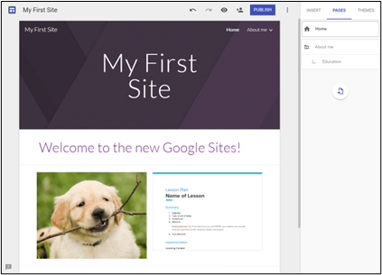
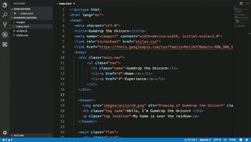

# Crear una web

## CREADORES DE WEBS ONLINE

Podemos crear una página web sin conocimientos de programación, utilizando páginas que nos ofrecen crear una web en base a plantillas que ellos ya nos dan hechas, y que podemos modificar y personalizar a nuestro gusto. Por ejemplo:

- Blogs: Wordpress.org
- Google sites: Google sites
- Wix: https://es.wix.com/

Algunas ofrecen servicios gratuitos con ciertas limitaciones, y otros planes de pago más orientados al mundo profesional.

## ENTORNOS DE DESARROLLO

Las páginas web se pueden hacer con muchos programas diferentes. Cualquiera que sirva para el texto, servirá para hacer una página web, incluso el bloc de notas.

- Editores online: Online HTML Editor - 𝗛𝗧𝗠𝗟-𝗢𝗻𝗹𝗶𝗻𝗲.𝗰𝗼𝗺
- De texto (Brackets, sublime text, atom)
- Visuales WYSIWYG (Kompozer)
- Entornos IDE (VS Code)
- Gestores de contenidos (Joomla, Wordpress)
- Visual studio Code y extensiones para HTML. Previsualización

La mayoría de estos programas tienen extensiones, pequeños programas que podemos añadirle para hacer más fácil la tarea de programar.
