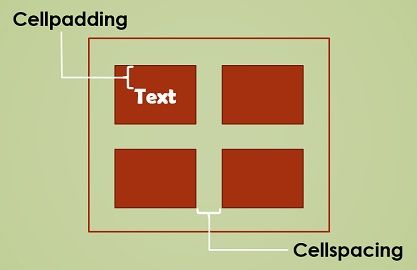

# 🌐 Introducció a Internet i la Web

## Què és Internet?

És com una **xarxa gegant d’ordinadors** connectats a tot el món.
Gràcies a Internet podem enviar missatges, veure vídeos, jugar en línia o cercar informació.

## Què és la Web?

La **Web** és només una part d’Internet.
Funciona amb el protocol **HTTP/HTTPS** i ens permet visitar **pàgines web**.

👉 Internet = autopistes de comunicació
👉 La Web = cotxes que circulen per aquestes autopistes

## 🖥️ Servidors

Un **servidor** és un ordinador especial que **guarda informació** (pàgines, imatges, vídeos...).
Quan entres en una web, el teu navegador demana aquesta informació al servidor i la rep en segons.

## 🌍 Navegadors

Un **navegador** és el programa que fem servir per visitar pàgines web.
Exemples: **Chrome, Firefox, Edge, Safari**.
El navegador transforma el codi en text, imatges i vídeos perquè el puguem entendre.

# 💻 Introducció als IDE i Visual Studio Code

## Què és un IDE?

Un **IDE (Entorn de Desenvolupament Integrat)** és un programa que ajuda els programadors a escriure i provar codi.
Un IDE sol incloure:

- ✍️ **Editor de codi** (on escrius el programa)
- 🐞 **Eines de depuració** (per trobar i corregir errors)
- ▶️ **Execució** (per provar el codi directament)
- 📂 **Gestió de fitxers i projectes**

👉 L’objectiu és **facilitar la vida al programador**, fent que programar sigui més ràpid i còmode.

## 🖥️ Visual Studio Code

**Visual Studio Code (VS Code)** és un dels IDEs més utilitzats al món.
És gratuït, funciona a Windows, Mac i Linux i té moltes extensions.

Algunes característiques de VS Code:

- 🎨 Coloreja el codi per entendre’l millor
- 🔍 Et mostra errors a mesura que escrius
- 📦 Permet afegir extensions (per a Python, C++, HTML, etc.)
- 🌍 Té suport per treballar amb Git i GitHub
- 🖱️ És molt lleuger i fàcil d’utilitzar

## 🌐 Canviar l’idioma a Visual Studio Code

1. Obre **Visual Studio Code**.
2. Prem `Ctrl + Shift + P` (o `Cmd + Shift + P` a Mac) per obrir la **Paleta de Comandes**.
3. Escriu `configurar idioma de visualització` o en anglès `Configure Display Language` i selecciona aquesta opció.
4. Apareixerà una llista d’idiomes disponibles. Tria **Català** (`ca`) o l’idioma que vulguis.
5. Reinicia VS Code perquè els canvis tinguin efecte.

💡 **Nota:**
Si no veus l’idioma que vols, pot ser que hagis d’instal·lar el **Language Pack** corresponent des de les extensions de VS Code.

# 🧩 Extensions a Visual Studio Code

Les **extensions** són complements que afegeixen funcions extra a Visual Studio Code.
Exemples: suport per diferents llenguatges de programació, temes visuals, eines per depurar codi, etc.

---

## ⚡ Instal·lar l’extensió Live Server

`Live Server` és una extensió que permet veure **en temps real** els canvis que fem en una pàgina HTML al navegador.

### Passos per instal·lar-la:

1. Obre **Visual Studio Code**.
2. Fes clic a la icona d’**Extensions** a la barra lateral esquerra (🧩).
3. A la barra de cerca, escriu `Live Server`.
4. Selecciona l’extensió creada per **Ritwick Dey** i fes clic a **Install**.
5. Quan acabi la instal·lació, obre un fitxer `.html`, fes clic dret i selecciona **Open with Live Server**.
   👉 Es obrirà el navegador i veuràs els canvis **automàticament** cada cop que guardis el fitxer.

💡 **Consell:**
També pots fer clic al botó **Go Live** que apareix a la cantonada inferior dreta per iniciar el Live Server ràpidament.

# 1. Introducció al llenguatge HTML

`HTML` (Hyper Text Markup Language) és un llenguatge que serveix per **crear pàgines web**.
Permet escriure **text estructurat** i afegir-hi **enllaços** (links) que porten a altres pàgines o recursos, que poden estar al teu ordinador o a Internet.

Amb HTML també podem incloure:

- 🖼️ Imatges i gràfics
- 🎞️ Animacions
- 🔊 Sons

Els navegadors (programs que utilitzem per veure pàgines web) llegeixen aquest codi i mostren la pàgina tal com volem.
Exemples de navegadors: **Google Chrome, Mozilla Firefox, Microsoft Edge, Opera**.

Una pàgina HTML és, en essència, **text normal** escrit amb qualsevol editor, però amb **etiquetes o elements** que indiquen com s’ha de mostrar el contingut.

# 2. Estructura d’un document HTML

El més important en HTML és l’ús de **les etiquetes** (tags).
Les etiquetes indiquen **on comença i on acaba** cada part del contingut.

Exemple general d’una etiqueta:

```html
<ETIQUETA> Contingut afectat per l’etiqueta </ETIQUETA>
```

Les lletres poden ser majúscules o minúscules, però per claredat solem fer-les majúscules.

Tot el que estigui entre <ETIQUETA> i </ETIQUETA> estarà afectat per aquesta etiqueta.

Tots els documents HTML comencen amb l’etiqueta <HTML> i acaben amb </HTML>:

```html
<html>
  <!-- Tot el contingut del document va aquí -->
</html>
```

# 🏗️ Estructura bàsica d’un document HTML5

Un document HTML5 té una estructura clara que els navegadors entenen.
Totes les pàgines web segueixen aquest esquema bàsic:

```html
<!DOCTYPE html>
<html lang="ca">
  <head>
    <meta charset="UTF-8" />
    <meta name="viewport" content="width=device-width, initial-scale=1.0" />
    <title>El teu títol aquí</title>
  </head>
  <body>
    <h1>Hola, món!</h1>
    <p>Aquest és el contingut de la pàgina.</p>
  </body>
</html>
```

# ⚡ Crear una pàgina HTML5 ràpidament a VS Code

Els **snippets** són fragments de codi que pots inserir ràpidament a Visual Studio Code.
Per exemple, podem crear un snippet per la **plantilla HTML5 bàsica** i reutilitzar-lo cada vegada.

A Visual Studio Code hi ha un **mètode molt ràpid** per crear la plantilla HTML5:

1. Crea un fitxer nou amb extensió `.html` (per exemple `index.html`).
2. Escriu **`html:5`** i prem **Tab** (o Enter, depenent de la configuració).
3. Automàticament apareixerà la **plantilla HTML5 completa**:

```html
<!DOCTYPE html>
<html lang="ca">
  <head>
    <meta charset="UTF-8" />
    <meta name="viewport" content="width=device-width, initial-scale=1.0" />
    <title>El teu títol aquí</title>
  </head>
  <body>
    <h1>Hola, món!</h1>
    <p>Aquest és el contingut de la pàgina.</p>
  </body>
</html>
```

# 🧩 Diferència entre `<head>` i `<body>`

En un document HTML5, el contingut es divideix principalment en dues parts:

## `<head>` → capçalera del document

- Conté **informació sobre la pàgina**, que normalment **l’usuari no veu directament**.
- Serveix per configurar el navegador, afegir estils i scripts.
- Exemples de què hi pot haver dins `<head>`:
  - `<title>` → el títol que apareix a la pestanya del navegador
  - `<meta>` → codificació de caràcters, informació de SEO, adaptació a mòbils
  - `<link>` → enllaços a fitxers CSS
  - `<script>` → enllaços a fitxers JavaScript

## `<body>` → cos del document

- Conté **tot el que veurà l’usuari** a la pàgina web.
- Aquí hi posarem:
  - Texts (`<p>`, `<h1>`...)
  - Imatges (``)
  - Enllaços (`<a>`)
  - Botons, vídeos, llistes, taules...

💡 **Regla fàcil de recordar:**

- `<head>` → coses que **configuren** la pàgina
- `<body>` → coses que **es veuen** a la pàgina

# 🚫 Els salts de línia en HTML

En HTML, **els salts de línia i els espais extra dins del codi no afecten com es mostra el text** al navegador.

Exemple:

```html
<p>Aquest és un text que escrivim en diverses línies.</p>
```

⚡ Es mostrarà així al navegador:

Aquesta és un text que escrivim en diverses línies.

# 💡 Salt de línia amb `<br>`

En HTML, si volem que un text **comenci en una nova línia**, hem d’utilitzar l’etiqueta `<br>`.

Exemple:

```html
<p>
  Aquesta és la primera línia.<br />
  Aquesta és la segona línia.
</p>
```

# 📄 Paràgrafs amb `<p>`

En HTML, els **paràgrafs** serveixen per separar blocs de text.
S’utilitza l’etiqueta `<p>` per indicar l’inici i el final d’un paràgraf.

Exemple:

```html
<p>Aquest és el primer paràgraf de text.</p>
<p>Aquest és el segon paràgraf, separat del primer.</p>
```

⚡ Al navegador es mostrarà així:

```
Aquest és el primer paràgraf de text.

Aquest és el segon paràgraf, separat del primer.
```

✅ Recorda:

- Cada paràgraf es tanca amb `</p>`
- Els salts de línia dins del paràgraf no es respecten; per fer un salt dins del paràgraf cal utilitzar `<br>`
- `<p>` ajuda a organitzar i llegir millor el text a la pàgina web

# ✏️ Formats de text en HTML

## 1. Negreta amb `<strong>` o `<b>`

```html
<p>Aquest text és <strong>important en negreta</strong>.</p>
<p>Aquest text també és <b>en negreta</b>.</p>
```

## 2. Cursiva

```html
<p>Aquest text està <i>només en cursiva</i> visualment.</p>
```

## 3. Subratllat

```html
<p>Aquest text està <u>subratllat</u> per destacar-lo.</p>
```

## Estilos de párrafo

Para asignar estilos, utilizaremos el atributo `style`.

```html
<p style="color:red;">Soy rojo</p>
<p style="color:blue;">Soy azul</p>
<p style="font-size:50px;">Soy grande</p>
```

# 6. Colores

Tenemos colores predefinidos en HTML con nombre (red, blue), pero también los podemos definir nosotros. Para ello se puede usar el sistema RGB, que nos permite afinar más el color que queramos.

```html
<p style="color:red;">Esto es rojo</p>
<p style="color:#FF0000;">Esto también es rojo</p>
```

## ¿Cómo podemos especificar un color en concreto?

El color es un código hexadecimal, formado por tres pares de dígitos, precedidos del símbolo #, que pueden ser números y letras entre [ 0 1 2 3 4 5 6 7 8
9 A B C D E F ].

Con estos dígitos el par de menor valor será el 00 y el de mayor valor
será el FF

Los colores primarios son:

| código RGB | color    |
| ---------- | -------- |
| #FF0000    | Rojo     |
| #00FF00    | Verde    |
| #0000FF    | Azul     |
| #FFFFFF    | Blanco   |
| #000000    | Negro    |
| #FFFF00    | Amarillo |

Oscurecer un color. Para hacer un color más oscuro, hay que reducir el
número de su componente, dejando los otros dos invariables. Así, el rojo #FF0000 se puede hacer más oscuro con #AA0000, o aún más oscuro con #550000.

Aclarar un color. Para hacer que un color tenga un tono más suave (más
pastel), se deben variar los otros dos colores haciéndolos más claros, aumentando
su componente, (número más alto), en una cantidad igual. Así, podemos convertir el
rojo en rosa con #FF7070.

# 7. ENLACES O HIPERVÍNCULOS.

Este elemento es uno de los más importantes del HTML, ya que es el que
realmente permite "navegar" por uno o varios documentos, que pueden
encontrarse en cualquier parte. Se definen los hipervínculos o hiperenlaces del
documento Web mediante la etiqueta `<A>`.

Sus comandos más importantes son: NAME, HREF y TARGET.

Vamos a distinguir tres tipos de enlaces:

- Enlaces dentro de la misma página.
- Enlaces con otra página, que puede encontrarse dentro o fuera de nuestro
  sistema.
- Enlaces con una dirección de correo electrónico.

## 7.1 ENLACES DENTRO DE LA MISMA PÁGINA

A veces, en el caso de documentos (o páginas) muy extensos, nos puede
interesar dar un salto desde una posición a otra determinada.
Podemos realizarlo de dos formas:

```html
<a href="#marca"> Zona Activa </a> (marca puede ser cualquier palabra).
<a name="marca">Zona Activa </a> (marca puede ser cualquier palabra).
```

## 7.2 ENLACES A OTRA PÁGINA

En este caso, simplemente sustituimos lo que hemos llamado marca (el
destino del enlace) por el nombre del fichero html.

```html
<a href="web02.html"> Zona Activa </a>
```

Si queremos hacer un enlace a una dirección web (URL), simplemente
sustituimos lo que hemos llamado marca (el destino del enlace) por la dirección de
la página web.

```html
<a href="http://colegioliceosorolla.es"> Zona Activa </a>
```

## 7.3 ENLACE A UNA DIRECCIÓN DE CORREO ELECTRÓNICO.

La estructura de la etiqueta es:

```html
<a href="mailto: dirección de email"> Zona Activa </a>
```

## 7.4 ENLACE EN UNA NUEVA VENTANA.

Se utiliza el comando TARGET. La estructura de la etiqueta será:

```html
<a href="indice.html" target="ventana2"> Nueva ventana </a>
```

# 8. IMÁGENES CON HTML

En HTML se debe indicar el nombre y la localización de un fichero que
contiene una imagen. Para ello utilizamos la etiqueta IMG con el comando SRC que
sirve para indicar donde se encuentra la imagen. La estructura de la etiqueta es:

```html

```

Dentro del atributo `src` especificamos la ruta para encontrar el archivo que queremos mostrar.

1. **Ruta absoluta:**

La ruta absoluta incluye el protocolo (como `https://`) y el dominio completo del sitio web. Se utiliza cuando la imagen está alojada en un servidor externo.

```html

```

2. R**uta relativa a la raíz:**

Esta ruta comienza con una barra inclinada (/) y hace referencia a la raíz del sitio web. Se usa cuando la imagen está ubicada en el servidor actual, pero a partir de la raíz del proyecto.

```html

```

Ruta relativa al archivo actual: Es la ruta más común para archivos locales, donde se especifica la ubicación de la imagen en relación con el archivo HTML actual.

```html

```

Ruta hacia un directorio superior: Si la imagen está en un directorio superior al archivo HTML, puedes usar ../ para navegar hacia arriba en la estructura de carpetas.

```html

```

Aquí puedes ver un ejemplo de cada opción

```html
<!-- Imagen desde un servidor externo -->


<!-- Imagen ubicada en la raíz del proyecto -->


<!-- Imagen en una carpeta relativa -->


<!-- Imagen en un directorio superior -->

```

## 8.1 COMANDAMENTS PER A LES IMATGES

L’atribut `alt` (abreviatura de "text alternatiu") s’utilitza a les etiquetes d’imatges (``) per **proporcionar una descripció de la imatge** quan aquesta no es pot mostrar.
És molt important per **l’accessibilitat web**, ja que els lectors de pantalla utilitzen aquest text per descriure la imatge a les persones amb discapacitat visual.

Exemple:

```html

```

⚡ Consell: Sempre posa un alt significatiu per a totes les imatges, així tothom podrà entendre el contingut de la pàgina.

## Modificar dimensiones de imágenes

El atributo **WIDTH:** Redefine el ancho de la imagen. Este atributo acepta valores en píxeles o como porcentaje del contenedor.

```html

```

## Imágenes y enlaces

Los **hipervínculos** pueden ser también definidos sobre **imágenes** de tal forma
que al hacer clic con el ratón sobre algún punto de la superficie de éstas, se pase al documento correspondiente.

Esto suele ser utilizado sobre todo para introducir botones de navegación en
las páginas HTML. Una imagen que actúa de hipervínculo se distingue mediante un
borde de color alrededor de ésta.

```html
<a href="https://www.ejemplo.com">
  
</a>
```

# 9. Listas

Una lista permite organizar un documento HTML estructurándolo de la
forma más clara posible, para hacerlo más perceptible al lector.

Las listas se utilizan para dividir el documento así como para efectuar numeraciones de objetos.

HTML define varios tipos de listas: **ordenadas** y **no ordenadas**


## Listas no ordenadas

```html
<ul>
  Elementos de la lista
</ul>
```

Los elementos de la lista irán precedidos por un símbolo (fijo por defecto) que
puede variar según el nivel de anidamiento de la lista. Cada elemento de la misma
llevará la etiqueta: `<LI> Primer elemento </LI>`

Ejemplo de lista no ordenada:

```html
<ul>
  <li>Aceite</li>
  <li>Cebolla</li>
  <li>Ajo</li>
</ul>
```

## Listas ordenadas

```html
<ol>
  Elementos de la lista
</ol>
```

La etiqueta `<OL>` se utiliza para una lista ordenada o numerada. Cada marca
`<LI>` incrementará el número que se visualizará delante del elemento de la lista.

Ejemplo de lista numerada:

Por ejemplo:

```html
<ol>
  <li>Echar el aceite y calentar</li>
  <li>Añadir cebolla y remover</li>
  <li>Pijar ajo y agregarlo</li>
</ol>
```

# 10. Tablas

Las **tablas** son una parte importante en HTML y se utilizan para presentar datos en una forma estructurada. En HTML5, se ha mejorado el soporte para tablas con nuevas etiquetas y atributos.

## 🗂️ Etiquetes de taules en HTML

La **etiqueta general** que engloba totes les altres és `<table>` i `</table>`:

````html
<table>
  <!-- Altres etiquetes de la taula aquí -->
</table>

Les etiquetes més comunes per crear taules en HTML5 són: -
<table>
  → Defineix la taula i conté totes les altres etiquetes a dins.
  <thead>
    → Defineix la capçalera de la taula, amb el títol i els encapçalaments de
    columna.tbody> → Defineix el cos de la taula, amb totes les files de dades.

    <tr>
      → Defineix una fila de la taula.

      <th>
        → Defineix una cel·la d’encapçalament de columna (normalment en negreta
        i centrada).
      </th>

      <td>
        → Defineix una cel·la de dades dins d’una fila. ## Filas y columnas
        Indicamos el comienzo de la primera fila con la etiqueta `
        <tr>
          `, y después marcamos en cuantas celdas dividiremos la fila con la
          etiqueta `
          <td>
            `. Para finalizar cada celda y cada fila cerraremos la etiquetas `
          </td>
          ` y `
        </tr>
        `. La estructura quedará de la siguiente forma: ```html
        <table border="1">
          <tr>
            <td>fila1-celda1</td>
            <td>fila1-celda2</td>
            <td>fila1-celda3</td>
          </tr>
          <tr>
            <td>fila2-celda1</td>
            <td>fila2-celda2</td>
            <td>fila2-celda3</td>
          </tr>
        </table>
      </td>
    </tr>
  </thead>
</table>
````

## Atributos

Las etiquetas de tabla también pueden tener atributos. Los atributos más comunes son:

- **border**: Establece el tamaño del borde de la tabla.

```html
<table border="1"></table>
```

Podemos cambiar el espacio dentro de las celdas o entre celdas con estas dos propiedades:

- **cellpadding**: Establece el tamaño del relleno de la celda
- **cellspacing**: Establece el tamaño del espacio entre las celdas

```html
<table cellspacing="2" cellpadding="3"></table>
```



- **width**: Establece el tamaño de la tabla.
- **align**: Establece la alineación de la tabla.

```html
<table align="left" border="1">
  <tr>
    <td>Agua</td>
    <td>1 l</td>
  </tr>
  <tr>
    <td>Leche desnatada</td>
    <td>200 ml</td>
  </tr>
</table>
```

- **bgcolor**: Establece el color de fondo de la tabla o de una celda

```html
<td bgcolor="“red”"></td>
```

## Ancho y alto

El valor de estos atributos se especifica en **píxeles**. Cuando no se les asigna ningún valor explícitamente estos atributos tomarán valores definidos por defecto.

Se puede determinar el tamaño de la tabla, bien forzándola a ocupar un
cierto porcentaje de la anchura de la ventana del navegador o definiendo un
tamaño fijo en unidades, mediante los atributos:

- `WIDTH`: define el ancho de la tabla, bien en % o en unidades.
- `HEIGTH`: define el alto de la tabla, bien en % o en unidades.

## Combinar celdas

Podemos romper la organización de filas y columnas combinando celdas para formar una sola. Para ello existen los atributos:

- `colspan`: define una celda con una anchura múltiplo de la columna básica.
- `rowspan`: define una celda con una anchura múltiplo de la fila básica.

## Estilos de tablas con CSS

Podemos crear estilos para nuestra tabla utilizando estilos CSS, definiéndolos en el HEAD de nuestro documento:

Si queremos poner un color de borde determinado:

```css
th,
td {
  border-color: #96d4d4;
}
```

Si queremos que todos los bordes se junten en uno solo, podemos agregar la propedad `border-collapse`.

```css
table,
th,
td {
  border: 1px solid black;
  border-collapse: collapse;
}
```

Con `padding`, podemos aumentar el espacio que queremos que haya entre el borde de la tabla y el texto:

```css
th,
td {
  padding: 15px;
}
```

Utilizando la propiedad `border-spacing`, podemos separar las celdas entre ellas:

```css
table {
  border-spacing: 30px;
}
```

# 11. Capas

Dentro de la etiqueta `<body>` de tu documento, agrega la etiqueta `<div>`. Esta etiqueta es la que servirá para crear la capa.

```html
<body>
  <div></div>
</body>
```

Dentro de la etiqueta `<div>`, agrega el contenido que quieras presentar. Puede ser cualquier cosa, desde un texto, una imagen, hasta otros elementos HTML. Es importante destacar que la etiqueta `<div>` se utiliza para agrupar contenido, no para presentarlo directamente.

```html
<div>Aquí va el contenido que quieras presentar</div>
```

Finalmente, para darle estilo a la etiqueta `<div>` y que se vea como una capa, agrega algunas etiquetas de estilo.

Por ejemplo:

```html
<div
  style="background-color: #cccccc; width: 200px; height: 200px; padding: 10px; margin: 10px;"
>
  Aquí va el contenido que quieras presentar
</div>
```

Con esto, habrás creado una capa div en tu documento HTML.

## Ejemplo de página con capas

```html
<!DOCTYPE html>
<html lang="en">
  <head>
    <meta charset="UTF-8" />
    <meta name="viewport" content="width=device-width, initial-scale=1.0" />
    <meta http-equiv="X-UA-Compatible" content="ie=edge" />
    <title>Document</title>
    <style>
      div {
        width: 100px;
        float: left;
      }
      div.cabecera {
        background-color: #da543c;
        border: 1px solid black;
        width: 100%;
      }
      div.menu {
        background-color: green;
        width: 30%;
      }
      div.principal {
        background-color: blue;
        width: 70%;
      }
    </style>
  </head>
  <body>
    <div class="cabecera">
      <h1>Esto es una capa</h1>
      <p>Esta capa va a ser roja</p>
    </div>
    <div class="menu">
      <h1>Esto es otra capa</h1>
      <p>Esta capa va a ser verde</p>
    </div>
    <div class="principal">
      <h1>Esto es otra capa</h1>
      <p>Esta capa va a ser verde</p>
    </div>
  </body>
</html>
```

# Formularis

- Input
- Form
- Datalist
- Atributo placeholder
- Atributo autofocus
- Validación restringida

# Àudio i vídeo

El elemento **video** nos permite incrustar video fácilmente. Un ejemplo muy simple luce como lo siguiente:

```html
<video src="rabbit320.webm" controls>
  <p>
    Tu navegador no soporta HTML5 video. Aquí está el
    <a href="rabbit320.webm">enlace del video</a>.
  </p>
</video>
```

https://developer.mozilla.org/es/docs/Web/HTML/Element/video#attr-controls

El elemento **audio** nos permite incrustar video fácilmente. Un ejemplo muy simple luce como lo siguiente:

El elemento **audio** funciona exactamente de la misma forma que el elemento **video**, con algunas pequeñas diferencias como se describe a continuación. Un ejemplo típico podría ser así:

<audio controls>
  <source src="viper.mp3" type="audio/mp3">
  <source src="viper.ogg" type="audio/ogg">
  <p>Your browser doesn't support HTML5 audio. Here is a <a href="viper.mp3">link to the audio</a> instead.</p>
</audio>
